# Meridian

> Turn unpaid invoices into immediate cash through sealed-bid financing — syndicate positions privately — settle atomically on Canton.

**Meridian** is a privacy-native **invoice financing** and **syndication** exchange on **Canton Network**.

- **Sealed-bid primary market** — suppliers invite financiers; competitors never see each other’s bids
- **Oracle-anchored pricing** — every bid tied to live, verified reference rates (SOFR)
- **Atomic CIP-56 settlement** — MUSD advance and payee assignment commit together, or not at all
- **Private syndication** — lead financiers lay off risk without involving buyer or supplier
- **Buyer-blind economics** — buyers see who to pay and how much — never discount rates or that financing occurred
- **Ledger-enforced privacy** — visibility is structural (signatory / observer / interface views), not UI filtering

**Stack:** Daml · Canton · CIP-56 MUSD · RedStone SOFR oracle · React portals · 5North Seaport DevNet

---

## Important Links

| Resource | Link |
|----------|------|
| Demo video | [View Here](https://www.youtube.com/watch?v=e8kpeoTvhj0) |
| Live app | [View Here](https://meridian-canton.up.railway.app/) |
| Pitch deck | [View Here](https://meridian-pitch.pages.dev) |
| **Full flow transaction logs** | [logs/TRANSACTIONS.md](https://github.com/Marshal-AM/meridian/blob/main/logs/TRANSACTIONS.md) · [logs/full-flow-latest.md](https://github.com/Marshal-AM/meridian/blob/main/logs/full-flow-latest.md) · [logs/](https://github.com/Marshal-AM/meridian/tree/main/logs) |

### Live DevNet transactions (latest full-flow run)

Captured on Seaport DevNet (`2026-07-12`). Every step below is a real Ledger API `updateId` with a Lighthouse explorer link. Full detail: [logs/TRANSACTIONS.md](https://github.com/Marshal-AM/meridian/blob/main/logs/TRANSACTIONS.md).

| # | Step | Explorer |
|---|------|----------|
| 1 | Propose invoice | [View](https://lighthouse.devnet.cantonloop.com/transactions/1220dc0cc03c4a6ee097d5cdd048fb365a847d018b2723ddad30e967358d25b84229) |
| 2 | Co-sign and issue receivable | [View](https://lighthouse.devnet.cantonloop.com/transactions/12208282a0d0e85f3d10811d470cedec11e2f94788183d3355cedb457d87424f1e6b) |
| 3 | Post receivable for bid | [View](https://lighthouse.devnet.cantonloop.com/transactions/1220575287c668eef94db6cabc08e7e952ebcee27c50386373db8afc1e584fe8d4c3) |
| 4 | Create financing round factory | [View](https://lighthouse.devnet.cantonloop.com/transactions/12201e4c850c28af3cdbafc825799dec00728db2443c19721301555e192f3dcc5339) |
| 5 | Open sealed-bid financing round | [View](https://lighthouse.devnet.cantonloop.com/transactions/12209ceb5cf17218a8c77aa4df2fcba29f3bea786a3d89c8783347562b085688eaf2) |
| 6 | Submit sealed bid (Financier A) | [View](https://lighthouse.devnet.cantonloop.com/transactions/122015e5e134a24ca0842ddbe483821aca41d737db6c0537bd2487d88ea2d74492c0) |
| 7 | CIP-56 allocate MUSD advance | [View](https://lighthouse.devnet.cantonloop.com/transactions/122063c53adcc834a1353252d97c1c75e361058dbafe6b314f9a41666720b7c5e041) |
| 8 | **AwardBid atomic DvP** | [View](https://lighthouse.devnet.cantonloop.com/transactions/122094109e36c5696c62b2cc4755c9f10315d34da234b0c0247522c4a85dfbb4dbf1) |
| 9 | Create syndication factory | [View](https://lighthouse.devnet.cantonloop.com/transactions/12203a5516737d2a50741b5d9662939c7161cb5926b0928c844361ea719da43ebcd0) |
| 10 | Open syndication offering | [View](https://lighthouse.devnet.cantonloop.com/transactions/1220048aa75686f78f3cd26184a8220563a363df9062c842dbc1f90dc4bce96a1f8f) |
| 11 | Submit sealed syndication bid (Financier B) | [View](https://lighthouse.devnet.cantonloop.com/transactions/1220752c72235ca083ffed2c129ceedfa0d53296755990d4b89b51e7a8790921a2b2) |
| 12 | Award syndication (participation interest) | [View](https://lighthouse.devnet.cantonloop.com/transactions/1220493276fa84d862c82105d20658e8b722f51d08e8b43a110a7fef60ace1f3d542) |
| 13 | CIP-56 waterfall allocation → Financier B | [View](https://lighthouse.devnet.cantonloop.com/transactions/12206c008e53ba4f715939a657fac693ea1b6d317e2d232592e0fcf5598415fefc39) |
| 14 | CIP-56 waterfall allocation → Financier A | [View](https://lighthouse.devnet.cantonloop.com/transactions/1220e39209aec219527a6c79b6cccb6d59a8b7e248ff3f8523984433f7d08f7b4f06) |
| 15 | Waterfall RepayWithProof | [View](https://lighthouse.devnet.cantonloop.com/transactions/1220b852a2748e345ea8a274a5b6d29d37889edd5655fa5ae5bf71c944cee716e97c) |

---

## Important Files (contracts, services, manifests)

GitHub links into this repository. Start here when reviewing the implementation.

### Daml — core packages

| File | What it is |
|------|------------|
| [PartyRegistry.daml](https://github.com/Marshal-AM/meridian/blob/main/daml/packages/meridian-core/daml/Meridian/Topology/PartyRegistry.daml) | `OrgRole` enum + KYB-gated `PartyRegistry` template |
| [Receivable.daml](https://github.com/Marshal-AM/meridian/blob/main/daml/packages/meridian-receivable/daml/Meridian/Receivable/Receivable.daml) | Tokenized invoice lifecycle, funding, syndication, repayment |
| [Interfaces.daml](https://github.com/Marshal-AM/meridian/blob/main/daml/packages/meridian-receivable/daml/Meridian/Receivable/Interfaces.daml) | `IBuyerView` … `IRegulatorView` privacy projections |
| [ReceivableProposal.daml](https://github.com/Marshal-AM/meridian/blob/main/daml/packages/meridian-receivable/daml/Meridian/Receivable/ReceivableProposal.daml) | Supplier draft → buyer `CoSignAndIssue` |
| [AssignmentConsentPolicy.daml](https://github.com/Marshal-AM/meridian/blob/main/daml/packages/meridian-receivable/daml/Meridian/Receivable/AssignmentConsentPolicy.daml) | Standing buyer consent to assign at award |
| [FinancingRequest.daml](https://github.com/Marshal-AM/meridian/blob/main/daml/packages/meridian-receivable/daml/Meridian/Financing/FinancingRequest.daml) | Sealed-bid room + atomic `AwardBid` DvP |
| [Bid.daml](https://github.com/Marshal-AM/meridian/blob/main/daml/packages/meridian-receivable/daml/Meridian/Financing/Bid.daml) | Sealed bid — financier signatory, supplier-only observer |
| [OracleValidation.daml](https://github.com/Marshal-AM/meridian/blob/main/daml/packages/meridian-receivable/daml/Meridian/Financing/OracleValidation.daml) | On-ledger RedStone / SOFR bid validation |
| [BiddingMandate.daml](https://github.com/Marshal-AM/meridian/blob/main/daml/packages/meridian-receivable/daml/Meridian/Financing/BiddingMandate.daml) | On-ledger agent risk limits |
| [MandateValidation.daml](https://github.com/Marshal-AM/meridian/blob/main/daml/packages/meridian-receivable/daml/Meridian/Financing/MandateValidation.daml) | Mandate constraint checks at bid time |
| [SyndicationOffering.daml](https://github.com/Marshal-AM/meridian/blob/main/daml/packages/meridian-receivable/daml/Meridian/Syndication/SyndicationOffering.daml) | Secondary sealed-bid room (buyer/supplier never observers) |
| [SyndicationBid.daml](https://github.com/Marshal-AM/meridian/blob/main/daml/packages/meridian-receivable/daml/Meridian/Syndication/SyndicationBid.daml) | Sealed syndication bid — lead-only observer |
| [ParticipationInterest.daml](https://github.com/Marshal-AM/meridian/blob/main/daml/packages/meridian-receivable/daml/Meridian/Syndication/ParticipationInterest.daml) | Pass-through repayment slice |
| [Waterfall.daml](https://github.com/Marshal-AM/meridian/blob/main/daml/packages/meridian-receivable/daml/Meridian/Syndication/Waterfall.daml) | Pro-rata repayment split |
| [Settlement/Types.daml](https://github.com/Marshal-AM/meridian/blob/main/daml/packages/meridian-receivable/daml/Meridian/Settlement/Types.daml) | `Atomic` / `ReassignmentMediated` / `EscrowFallback` |
| [SettlementAuditRecord.daml](https://github.com/Marshal-AM/meridian/blob/main/daml/packages/meridian-receivable/daml/Meridian/Settlement/SettlementAuditRecord.daml) | Immutable finality audit at award |
| [RepaymentProof.daml](https://github.com/Marshal-AM/meridian/blob/main/daml/packages/meridian-receivable/daml/Meridian/Receivable/RepaymentProof.daml) | Buyer payoff proof (no financing fields) |
| [RegulatorJurisdictionGrant.daml](https://github.com/Marshal-AM/meridian/blob/main/daml/packages/meridian-receivable/daml/Meridian/Compliance/RegulatorJurisdictionGrant.daml) | Scoped regulator observer grant |
| [Registry.daml](https://github.com/Marshal-AM/meridian/blob/main/daml/packages/meridian-cash/daml/Meridian/Cash/Registry.daml) | `CashRegistry` + CIP-56 `MusdRules` factories |
| [Holding.daml](https://github.com/Marshal-AM/meridian/blob/main/daml/packages/meridian-cash/daml/Meridian/Cash/Holding.daml) | CIP-56 `MusdHolding` |
| [Allocation.daml](https://github.com/Marshal-AM/meridian/blob/main/daml/packages/meridian-cash/daml/Meridian/Cash/Allocation.daml) | CIP-56 locked DvP allocation |
| [Transfer.daml](https://github.com/Marshal-AM/meridian/blob/main/daml/packages/meridian-cash/daml/Meridian/Cash/Transfer.daml) | CIP-56 transfer instruction |

### Off-ledger services & packages

| File | What it is |
|------|------------|
| [portal-api/src/index.ts](https://github.com/Marshal-AM/meridian/blob/main/services/portal-api/src/index.ts) | BFF — command submission + indexer proxy |
| [ledger-client/commands.ts](https://github.com/Marshal-AM/meridian/blob/main/packages/ledger-client/src/commands.ts) | Daml command builders (`AwardBid`, CIP-56 allocate, …) |
| [shared-types/src/index.ts](https://github.com/Marshal-AM/meridian/blob/main/packages/shared-types/src/index.ts) | `OrgRole`, projections, `SettlementFinality` TS mirrors |
| [oracle-relay-service.ts](https://github.com/Marshal-AM/meridian/blob/main/services/oracle-relay/src/oracle-relay-service.ts) | RedStone SOFR cache for bids |
| [registry-api/src/index.ts](https://github.com/Marshal-AM/meridian/blob/main/services/registry-api/src/index.ts) | CIP-56 MUSD discovery for wallets |
| [replay-indexer.ts](https://github.com/Marshal-AM/meridian/blob/main/services/indexer/src/replay-indexer.ts) | Per-party ledger replay → projections |
| [agent-loop.ts](https://github.com/Marshal-AM/meridian/blob/main/services/agent-runtime/src/agent-loop.ts) | Mandate-constrained AI bidder |
| [apps/portal/src/lib/roles.ts](https://github.com/Marshal-AM/meridian/blob/main/apps/portal/src/lib/roles.ts) | Demo role chooser (Supplier / Buyer / Financier / Ops) |

### DevNet manifests & bootstrap

| File | What it is |
|------|------------|
| [parties.devnet.json](https://github.com/Marshal-AM/meridian/blob/main/infra/manifests/parties.devnet.json) | Eight allowlisted Seaport personas |
| [cash.devnet.json](https://github.com/Marshal-AM/meridian/blob/main/infra/manifests/cash.devnet.json) | MUSD bootstrap balances |
| [allocate-devnet-parties.ts](https://github.com/Marshal-AM/meridian/blob/main/scripts/allocate-devnet-parties.ts) | Party allocation script |
| [fund-devnet-parties.ts](https://github.com/Marshal-AM/meridian/blob/main/scripts/fund-devnet-parties.ts) | CC tap via Wallet SDK |
| [capture-full-flow-logs.ts](https://github.com/Marshal-AM/meridian/blob/main/scripts/capture-full-flow-logs.ts) | Full-flow DevNet run → `logs/` + explorer links |
| [logs/TRANSACTIONS.md](https://github.com/Marshal-AM/meridian/blob/main/logs/TRANSACTIONS.md) | Latest run: all updateIds + Lighthouse URLs |

### Privacy / workflow tests (Daml Script)

| File | What it proves |
|------|----------------|
| [FinancingTest.daml](https://github.com/Marshal-AM/meridian/blob/main/daml/tests/daml/Meridian/FinancingTest.daml) | Sealed-bid privacy + award atomicity |
| [SyndicationTest.daml](https://github.com/Marshal-AM/meridian/blob/main/daml/tests/daml/Meridian/SyndicationTest.daml) | Buyer/supplier cannot see syndication |
| [ReceivableTest.daml](https://github.com/Marshal-AM/meridian/blob/main/daml/tests/daml/Meridian/ReceivableTest.daml) | Interface-view privacy + SCU |
| [MandateTest.daml](https://github.com/Marshal-AM/meridian/blob/main/daml/tests/daml/Meridian/MandateTest.daml) | On-ledger agent mandate enforcement |
| [CashTest.daml](https://github.com/Marshal-AM/meridian/blob/main/daml/tests/daml/Meridian/CashTest.daml) | CIP-56 MUSD mint / transfer / allocate |

---

## Participants

Meridian is a multi-party workflow. Each participant below is a **Party** on Canton — a durable institutional identity, not an anonymous wallet address.

| Participant | Role in the product |
|-------------|---------------------|
| **Supplier** | Issues invoices, opens financing rounds, compares sealed bids, awards the winner, and tracks when invoices are repaid. |
| **Buyer** | Co-signs invoices, sees payment obligations (amount, due date, payee), and repays the current payee-of-record at maturity — never the financing terms. |
| **Financier** | Receives round invitations, submits sealed bids anchored to live reference rates, holds funded positions, and may lead or join syndication offerings. Two financiers prove sealed-bid privacy in demo scenarios. |
| **Registry** | Issues and governs **MUSD**, the tokenized cash leg used for advances and repayments, in compliance with Canton's token standard so external wallets can discover and move it. |
| **Oracle provider** | Anchors bid pricing to verified market reference rates (SOFR via RedStone on DevNet); production path targets on-ledger Chainlink verification. |
| **Platform operator** | Operates onboarding, settlement-finality monitoring, and regulator grant administration — deliberately **without** access to individual bid terms or syndication pricing. |
| **Regulator** | Optional jurisdiction-scoped observer of aggregate exposure — never per-trade commercial detail. |

---

## Disclaimer: Why the demo uses fixed parties (not “bring your own wallet”)

**For judges:** Meridian does **not** let an arbitrary Canton DevNet wallet connect and play Supplier, Buyer, or Financier. That is intentional — not a missing feature we overlooked.

### What you will see in the demo

- The portal is a **role chooser** (Supplier / Buyer / Financier / Platform Ops). Switching roles changes which UI you use.
- Every ledger action runs as one of **eight pre-allocated DevNet parties** recorded in [`parties.devnet.json`](https://github.com/Marshal-AM/meridian/blob/main/infra/manifests/parties.devnet.json).
- Commands are submitted with the shared Seaport **M2M** validator credentials (`actAs` those parties). There is **no end-user wallet connect** and no “sign with my own Canton account” path in the app.

### Why this is the correct model on Seaport DevNet

1. **Allowlisting is required by the network operators.** On 5North’s shared Seaport sandbox, each Party ID must be **manually allowlisted** by the Canton / validator team before it can submit real transactions. Open self-serve onboarding (“any wallet → any role”) is blocked at the infrastructure gate, not only in our UI. Supporting BYO wallets would mean a human allowlist ticket, rights grants, MUSD funding, and a dedicated indexer for every new user — without proving anything extra about sealed-bid privacy or atomic settlement.

2. **Meridian is institutional multi-party finance, not permissionless DeFi.** Canton actors are durable **Parties** (supplier, buyer, financier desks), not anonymous addresses hopping between roles. The product target is KYB-gated counterparties joining a private financing workflow. Fixed, named personas are the right demo stand-in for “already onboarded institutions.”

3. **Daml privacy is still real.** All eight personas share one physical validator for this hackathon track, but sealed-bid isolation is enforced by **signatory / observer rules on the ledger**. Financier A genuinely cannot read Financier B’s bid contracts. What we are *not* claiming yet is production-grade infrastructure separation (one validator trust root per organization) — that is deferred; privacy guarantees for Phases 1–4 do not depend on it.

4. **Onboarding hooks exist; self-serve wallets do not.** Platform Ops can run a **KYB stub → party allocation** path. That proves the gate design. It does **not** wire a newly allocated party into the portals. Wiring every allocated party into the live demo would still hit allowlisting and would dilute the judge-facing story.

### What this demo is meant to prove

| We prove | We do not claim yet |
|----------|---------------------|
| Sealed-bid financing, award DvP, syndication, buyer-blind repayment | Anyone with a DevNet wallet can self-onboard |
| Party-scoped privacy on a real DevNet ledger | Per-organization validator separation (later track) |
| CIP-56 MUSD cash leg + oracle-anchored pricing | Production KYB / user-wallet signing |

**Bottom line for judges:** Fixed demo parties + M2M submission is the honest design for a shared, allowlist-gated DevNet and for an institutional Canton product. Asking “why can’t I connect my wallet?” is answered by Canton’s party model and Seaport’s allowlisting — not by a gap in Meridian’s core workflow.

---

## Table of Contents

1. [Important Files](#important-files-contracts-services-manifests)
2. [Disclaimer: Why the demo uses fixed parties](#disclaimer-why-the-demo-uses-fixed-parties-not-bring-your-own-wallet)
3. [Introduction](#introduction)
4. [The Problem](#the-problem)
5. [The Solution](#the-solution)
6. [Architecture](#architecture)
7. [How Canton Network Enables Meridian](#how-canton-network-enables-meridian)
8. [On-Ledger Model](#on-ledger-model)
9. [Daml Contracts](#daml-contracts)
10. [Off-Ledger and Application Layer](#off-ledger-and-application-layer)
11. [Roadmap](#roadmap)
12. [Conclusion](#conclusion)

---

## Introduction

### What Meridian Is

Meridian is a **private invoice financing and syndication exchange** on Canton. A supplier with a legitimate receivable needs working capital without exposing bid terms, buyer relationships, or discount economics to the wrong parties.

The **primary market** is a sealed-bid auction among invited financiers. The supplier opens a round with an oracle-anchored pricing band; financiers submit private bids; the supplier sees all bids ranked by effective rate. **Award** is one atomic commit: bid accepted, payee reassigned to the financier, MUSD advanced to the supplier.

The **secondary market** lets a lead financier sell **participation interests** — pass-through rights to repayment proceeds, not a change of who the buyer pays. Syndication reuses sealed-bid machinery; buyer and supplier are never observers.

Privacy is structural: Canton distributes encrypted views only to contract stakeholders. Uninvited financiers cannot query a round's existence on the ledger.

Meridian simultaneously guarantees:

1. **Real receivable coverage** — jointly issued by supplier and buyer with assignment consent.
2. **Sealed bidding** — each financier's terms visible only to that financier and the supplier until award.
3. **Oracle-anchored pricing** — stale feeds pause the round or switch to a labeled fallback — never silent substitution.
4. **Atomic settlement** — assignment and cash indivisible at award; waterfall indivisible when syndicated.
5. **Buyer privacy** — no discount rate, pre-need financier identity, or syndication signal.
6. **Honest settlement classification** — every trade records atomic, reassignment-mediated, or escrow-fallback finality.

### The Privacy Boundary

| Data element | Visible to | Hidden from | Why it matters |
|--------------|------------|-------------|----------------|
| Invoice face value | Supplier, buyer, invited financiers | Uninvited financiers | Core asset definition |
| Competing bid terms | Supplier; each financier (own only) | Other financiers | Honest auction |
| Discount / advance economics | Supplier; winning financier | **Buyer always** | No distress signal |
| Buyer identity pre-award | Supplier; anonymized to financiers | Other financiers | Relationship privacy |
| Syndication cap table | Lead financier | Participants (own slice); buyer; supplier | Secondary confidentiality |
| Settlement finality class | All trade stakeholders | — | Treasury risk assessment |
| Regulator pricing | — | Regulator (aggregate only) | Supervision without surveillance |

The diagram below shows how one financing round projects different facts to each party — not one shared screen with redacted fields.

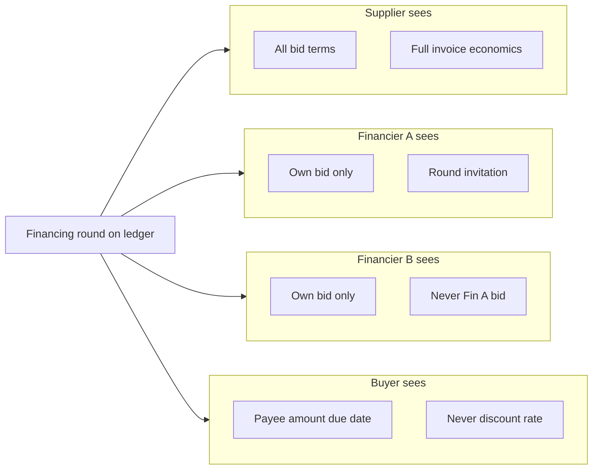

Each subgraph is a separate ledger view — not one database with column-level ACLs.

### Technical Innovations

**1. Interface-view privacy** — One receivable, six typed projections (buyer, supplier, financier, lead, participant, regulator). Privacy is assigned at design time, not configured in the UI.

**2. Sealed-bid + oracle pricing** — Private auction rooms with one bid per financier. Bids anchor to a fresh reference rate inside the supplier's band; stale feeds pause the round or switch to a labeled fallback.

**3. Atomic DvP at award** — Bid acceptance, payee reassignment, MUSD transfer, and settlement audit record in one commit. Partial outcomes are impossible.

**4. Pass-through syndication** — Participation interests sell economic rights to repayment; payee stays with the lead; waterfall splits proceeds on-ledger at maturity.

**5. Mandate-gated agents** — Financiers may delegate bidding to an AI agent, but risk limits live on the ledger. Out-of-mandate bids fail at the contract, not in agent code.

### Interface Views and Selective Disclosure

Each portal authenticates as one party and renders only that party's ledger entitlement — not redacted copies of a shared database.

| View | Answers | Withheld |
|------|---------|----------|
| **Buyer** | Who to pay, how much, when | Discount, financing, syndication |
| **Supplier** | Full economics and bid history | — |
| **Financier** | Invitation and headline terms | Other financiers' bids |
| **Lead** | Syndication cap table | — |
| **Participant** | Own slice | Others' entry prices |
| **Regulator** | Aggregate exposure | Per-trade commercial detail |

Each arrow is a separate interface projection — parties never download the full receivable and filter locally.

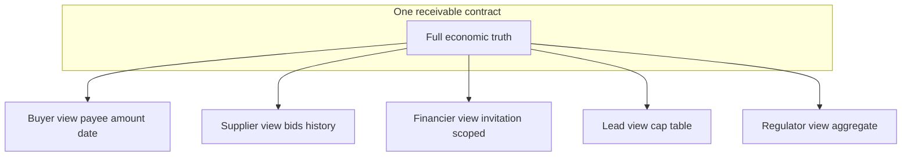

### System overview

Commands flow inward (portal → coordination → ledger); read models flow outward (ledger events → indexer → portal). The ledger is the only source of truth.

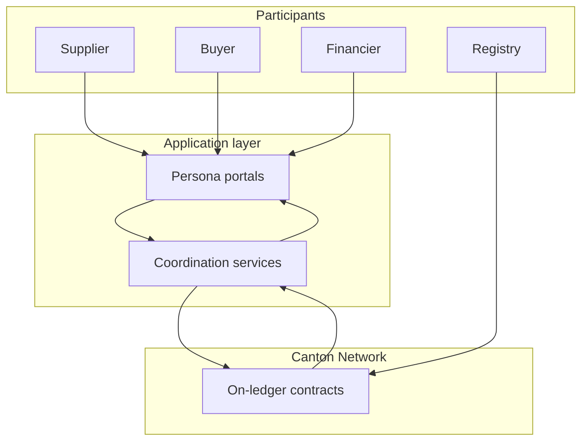

Participants never talk to Canton directly — portals and coordination services mediate every read and write.

---

## The Problem

### Invoice Privacy Is Broken Everywhere

Invoice financing still runs on email, PDF, and spreadsheets. **Privacy failures destroy market economics:** visible bids collapse price discovery; exposed buyer relationships create leverage risk; financiers won't share rate books but need credit signal; everyone needs assignment and payment to change together at funding.

Post-funding, financiers want to syndicate exposure without involving the buyer or revealing participant pricing to each other.

### Why Existing Approaches Fail

| Approach | Privacy model | Settlement | Verdict |
|----------|---------------|------------|---------|
| Email / PDF factoring | Centralized, breachable | Manual reconciliation | No trust minimization |
| Public blockchain | Full transparency | Atomic transfer possible | Destroys bid secrecy and buyer privacy |
| Private consortium database | Operator sees all | Bilateral APIs | No interoperability; platform risk |
| Generic tokenized receivables | Varies | Token transfer ≠ assignment | Domain logic missing |

Canton targets **privacy and atomic multi-party workflow together** — the combination generic approaches miss.

### The Gap Meridian Fills

| Market requirement | Meridian response |
|--------------------|-------------------|
| Sealed bids | Observer-scoped bid contracts — not UI hiding |
| Buyer never sees discount | Buyer interface view omits all financing economics |
| Atomic assignment + cash | Single commit at award and at syndicated repayment |
| Oracle-linked pricing | Bids rejected if oracle stale; labeled fallback if feed down |
| Private syndication | Participation interests; buyer/supplier not observers |
| Institutional topology | Settlement finality recorded honestly per topology |
| Wallet interoperability | CIP-56 MUSD and participation metadata |

---

## The Solution

### Supplier obtains financing

1. **Issue and co-sign** — Supplier proposes; buyer co-signs with assignment consent. A **receivable** is issued. Buyer sees amount, due date, payee only.
2. **Post for bid** — Receivable marked ready for financing.
3. **Open round** — Supplier invites financiers, sets pricing band and deadline. Only invitees see the round.
4. **Sealed bidding** — Financiers submit oracle-anchored bids. Supplier ranks by effective rate; competitors never see each other's terms.
5. **Award and cash** — One transaction: bid closes, payee → financier, MUSD → supplier, settlement audit record written.
6. **Maturity** — Buyer repays; supplier receives **repayment proof**.

*Supplier sees full economics throughout. Buyer never sees bid terms. Financiers never see competitor bids.*

### Buyer fulfills an obligation

Co-sign at issuance → **obligations dashboard** (amount, due date, payee — no discount or syndication) → **repay** payee-of-record in MUSD at maturity. Financing economics are absent from buyer views, APIs, and event streams — not just hidden in the UI.

### Financier bids and wins

Invitation with anonymized buyer context → manual or **agent-assisted bid** anchored to SOFR → win/loss revealed only at award settlement → optional syndication as lead.

### Financier syndication

Lead opens **syndication offering** → participants submit sealed yield bids → lead awards slices → **waterfall** splits repayment on-ledger. Buyer and supplier learn nothing new.

### Institutional buyer and cross-domain settlement

When buyers or registries sit on **private synchronizers**:

- Financing and award stay **atomic** on the shared network.
- Buyer notice crosses domains via Canton **reassignment** (not off-chain messaging).
- Trades label **reassignment-mediated** or **escrow-fallback** honestly — never oversold as fully atomic.

### Ledger guarantees

- Atomic multi-party commit at award, syndication award, and syndicated repayment
- Sealed bids enforced by ledger observers
- Non-silent oracle degradation (paused / labeled fallback)
- Immutable settlement finality classification

### Why Canton is load-bearing

Meridian is not “a DApp that happens to use Canton.” Every privacy and settlement guarantee below depends on a Canton-native capability. The full feature → code map is in [How Canton Network Enables Meridian](#how-canton-network-enables-meridian).

| Canton property | What it enables for Meridian |
|-----------------|------------------------------|
| Parties, not addresses | Institutional identities with hosted participant nodes |
| Sub-transaction privacy | Invited-only observers on financing and syndication rooms |
| Atomic multi-party commit | DvP, payee reassignment, waterfall without reconciliation jobs |
| CIP-56 token standard | MUSD discoverable by compliant wallets; allocation-based DvP |
| Network of networks | Cross-synchronizer reassignment and honest finality labels |
| Interface views | Typed, party-scoped projections of one receivable |
| Smart Contract Upgrade | Evolve templates without breaking counterparties |

### Settlement finality — what treasury should understand

| Classification | Meaning for risk | When it applies |
|----------------|------------------|-----------------|
| **Atomic** | Single synchronizer; one commit settles assignment and cash | Default when all parties share a domain |
| **Reassignment-mediated** | Core trade atomic on shared network; buyer notice crosses domains | Buyer on private synchronizer |
| **Escrow-fallback** | Bounded escrow with timeout | Registry on distinct synchronizer |

Finality labels are immutable on the audit record and shown wherever a trade appears.

---

## Architecture

### Layered system design

| Layer | Responsibility |
|-------|----------------|
| **On-ledger (Daml)** | Issuance, bidding, award, syndication, repayment, mandates, audit |
| **Participant nodes** | Per-institution Canton parties |
| **Coordination / read** | Indexers, oracle relay, notifications, onboarding — rebuildable, no ledger authority |
| **Persona portals** | Supplier, buyer, financier, ops — party-scoped views only |

Commands go portal → coordination → ledger; reads go ledger → indexer → portal.

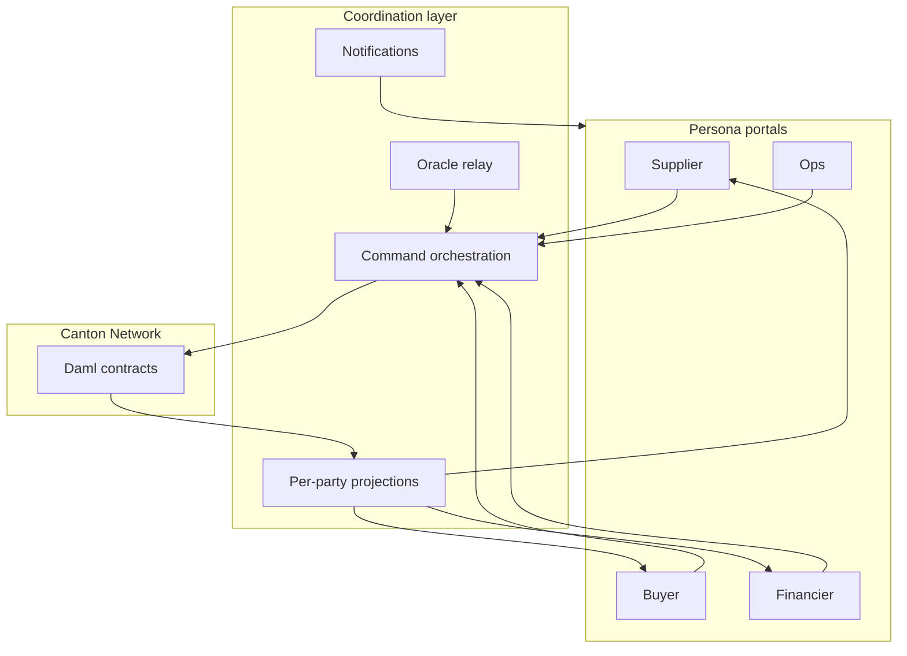

Each portal talks only to coordination services for its organization; only the ledger holds authoritative contract state.

### End-to-end financing sequence

Happy path from invoice creation through cash advance — each arrow is a ledger commit or projection update.

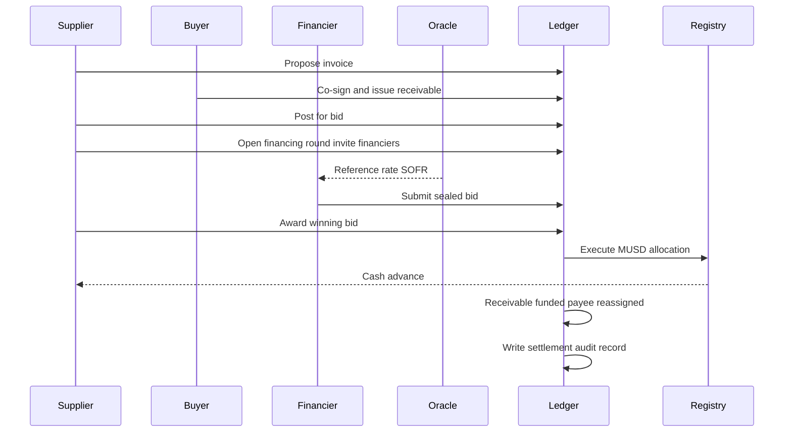

When the supplier awards, the ledger validates round state, deadline, bid ownership, oracle anchor, and MUSD amount before payee changes and cash moves.

### Syndication and waterfall sequence

After funding, the lead syndicates to invited participants. The buyer is not an observer — payee stays with the lead until maturity, when one repayment triggers a contract-enforced waterfall.

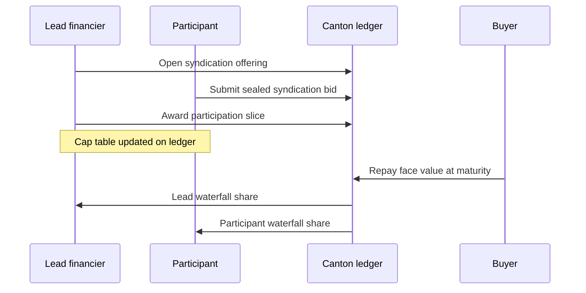

The lead sees the full cap table; each participant sees only their slice. Buyer and supplier observe no syndication contracts.

### Repayment and proof-of-payoff

Buyer pays the **current payee-of-record**. Syndicated receivables split proceeds in one transaction; the buyer still performs one repayment action.

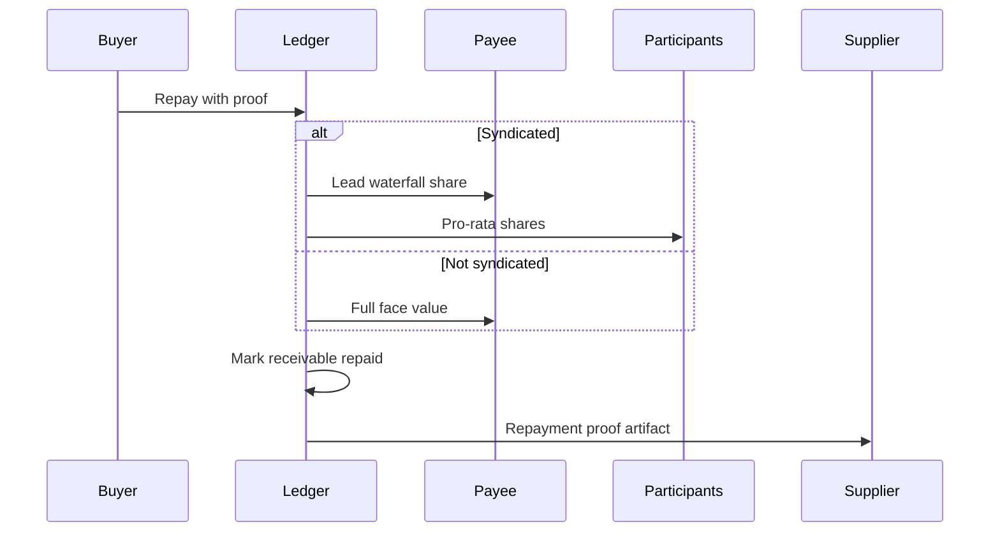

The **repayment proof** lets the supplier prove payoff without contacting the buyer.

### Oracle anchoring and fallback

Each bid must cite a fresh oracle report within the supplier's pricing band. Stale feeds pause the round; prolonged outage may switch to a **labeled static fallback** — never silent manual pricing.

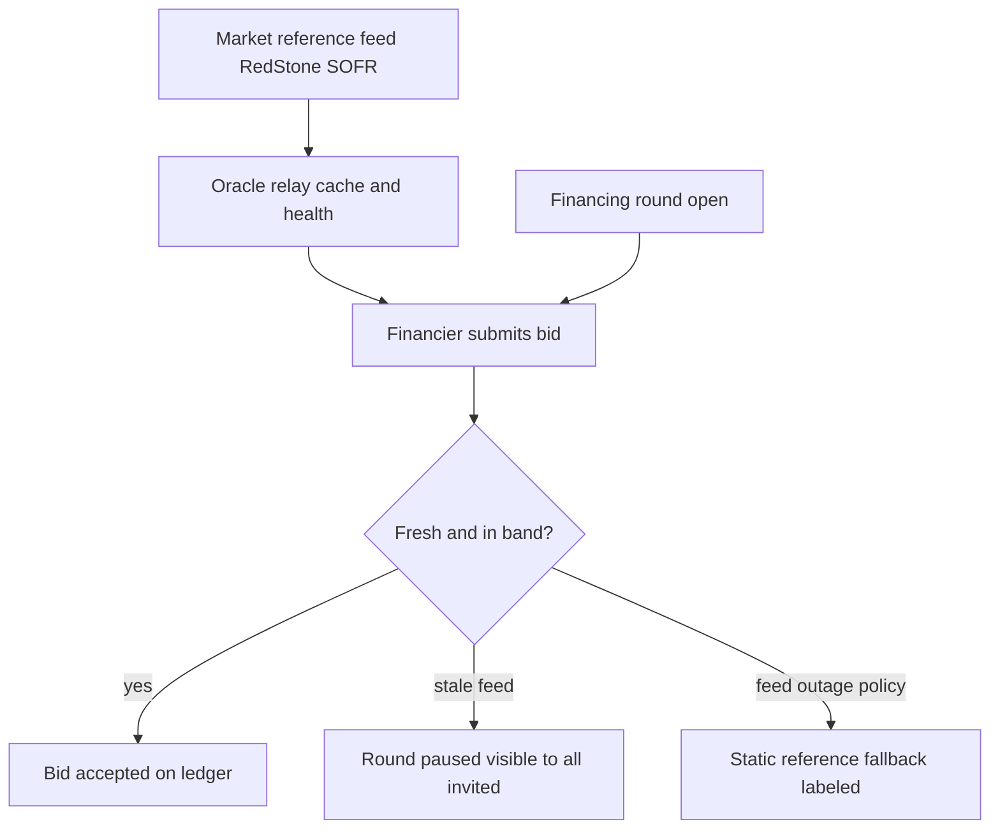

Invited financiers always see when a round is paused or in fallback mode.

### Sealed-bid privacy between financiers

Both financiers observe the round but receive **disjoint bid contracts** — Financier B's node never stores Financier A's bid.

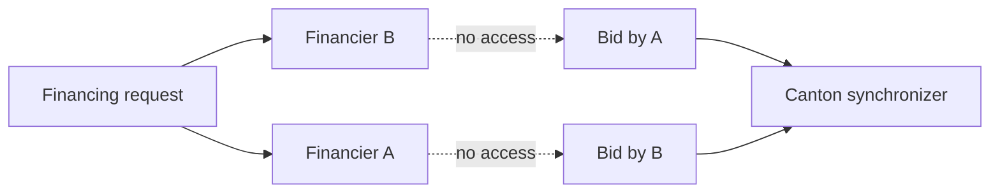

Privacy comes from Canton's encrypted view distribution, not portal ACL configuration.

### Interface-view scoping on one receivable

One contract, multiple projections — each party queries only its interface:

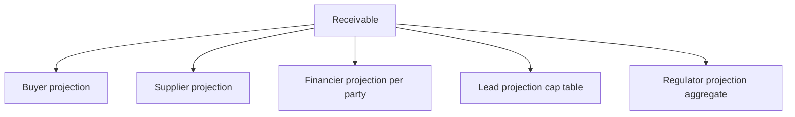

### Receivable lifecycle

States track the invoice from issuance through funding, optional syndication, and terminal outcomes:

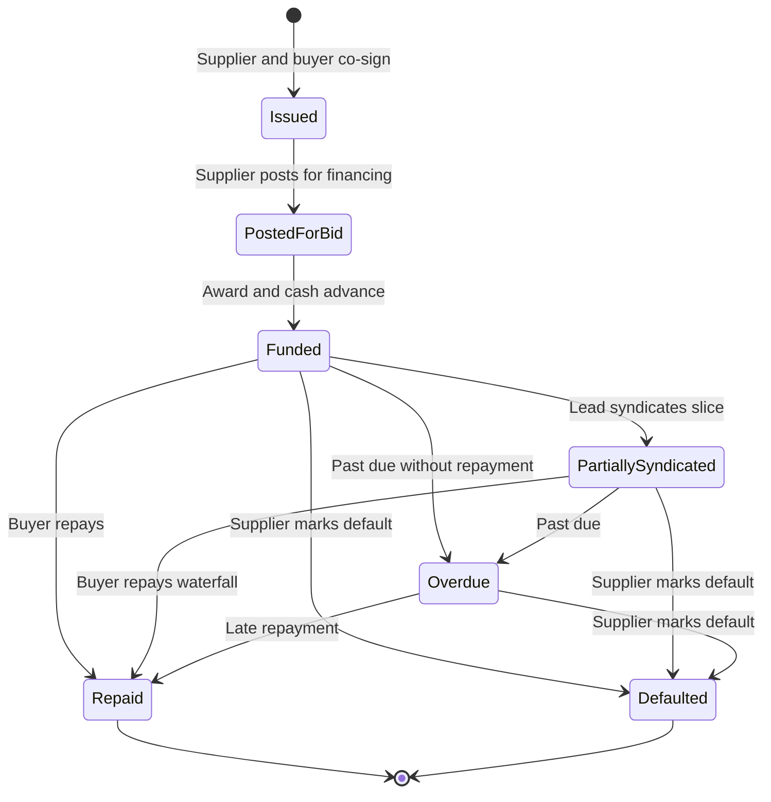

| State | Meaning |
|-------|---------|
| **Issued** | Valid tokenized invoice; not yet offered for financing |
| **PostedForBid** | Supplier may open a financing round |
| **Funded** | Winning financier is payee-of-record; advance paid |
| **PartiallySyndicated** | Lead sold participation; cap table active |
| **Repaid** | Buyer satisfied obligation; proof available |
| **Overdue** | Due date passed; payee notified — no collections logic |
| **Defaulted** | Supplier marked credit event |

Suppliers see **Funded** when syndicated internally — not cap-table detail.

### Financing round lifecycle

A round starts open for bids, may pause on oracle issues, and ends in award or expiry:

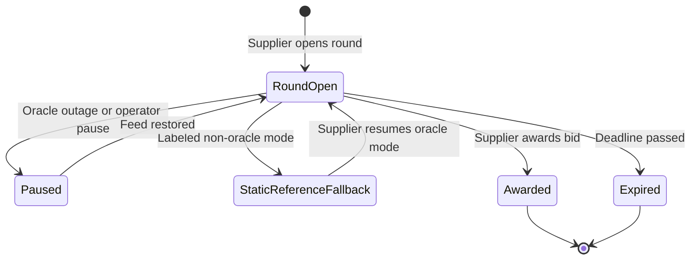

**Paused** and **StaticReferenceFallback** are visible to all invitees — financiers know when oracle pricing is unavailable. **Awarded** and **Expired** are terminal; no further bids accepted.

### Indexer and read models

Each org replays **only its party's** ledger stream into local dashboards. Indexers rebuild from the stream if lost — they never invent or cross-merge org data.

The append-only log is the rebuild source; portal dashboards are disposable projections.

### Coordination services — roles in the product

| Service | What it does for users |
|---------|------------------------|
| **Command orchestration** | Turns portal actions into ledger commands; holds no independent authority over financing outcomes |
| **Per-party indexers** | Supply supplier bid-comparison, buyer obligations, financier inboxes, ops finality panels |
| **Oracle relay** | Keeps reference rates fresh; exposes health for ops when feeds degrade |
| **Notifications** | Pushes issuance, invitation, award, and repayment events to connected portals in real time |
| **Agent runtime** | Polls financier inbox, proposes bids within mandate; ledger rejects out-of-policy bids |
| **Onboarding gate** | KYB verification must complete before new parties allocate on the network |
| **Registry API** | Lets external wallets discover MUSD metadata and holdings under CIP-56 |

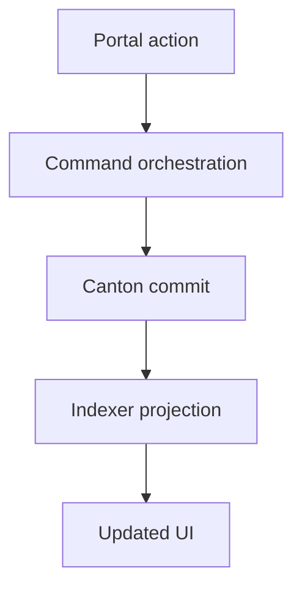

This round-trip applies to every portal action — issue, bid, award, repay. Notifications can push events before the user refreshes.

---

## How Canton Network Enables Meridian

Every Meridian guarantee maps to a **Canton-native** capability. Below: the feature, why Meridian needs it, and **exact code** where it is used. Links open on GitHub at the cited lines (`main` branch).

### 1. Parties — durable institutional identities (not wallet addresses)

Canton actors are `Party` values bound to a participant node. Meridian roles (Supplier, Buyer, Financier, …) are parties, not ephemeral addresses.

| Where | Link |
|-------|------|
| On-ledger `OrgRole` enum | [PartyRegistry.daml L7–15](https://github.com/Marshal-AM/meridian/blob/main/daml/packages/meridian-core/daml/Meridian/Topology/PartyRegistry.daml#L7-L15) |
| `Receivable` supplier/buyer as `Party` | [Receivable.daml L21–22](https://github.com/Marshal-AM/meridian/blob/main/daml/packages/meridian-receivable/daml/Meridian/Receivable/Receivable.daml#L21-L22) |
| DevNet persona roster (8 parties) | [parties.devnet.json L7–70](https://github.com/Marshal-AM/meridian/blob/main/infra/manifests/parties.devnet.json#L7-L70) |
| TypeScript `OrgRole` mirror | [shared-types L1–9](https://github.com/Marshal-AM/meridian/blob/main/packages/shared-types/src/index.ts#L1-L9) |
| Allocation script personas | [allocate-devnet-parties.ts L14–28](https://github.com/Marshal-AM/meridian/blob/main/scripts/allocate-devnet-parties.ts#L14-L28) |

### 2. Signatory / observer — sub-transaction privacy by construction

Visibility is declared on the contract. The synchronizer delivers encrypted views only to stakeholders. Meridian’s sealed bids and private syndication rooms are this mechanism — not UI filtering.

| Pattern | Signatory | Observer | Link |
|---------|-----------|----------|------|
| Sealed primary bid | financier | **supplier only** | [Bid.daml L27–28](https://github.com/Marshal-AM/meridian/blob/main/daml/packages/meridian-receivable/daml/Meridian/Financing/Bid.daml#L27-L28) |
| Financing round | supplier | invited financiers | [FinancingRequest.daml L34–35](https://github.com/Marshal-AM/meridian/blob/main/daml/packages/meridian-receivable/daml/Meridian/Financing/FinancingRequest.daml#L34-L35) |
| Receivable | supplier + buyer | payee, platform, compliance | [Receivable.daml L40–41](https://github.com/Marshal-AM/meridian/blob/main/daml/packages/meridian-receivable/daml/Meridian/Receivable/Receivable.daml#L40-L41) |
| Syndication offering | lead | invited participants **only** (comment L15) | [SyndicationOffering.daml L15, L33–34](https://github.com/Marshal-AM/meridian/blob/main/daml/packages/meridian-receivable/daml/Meridian/Syndication/SyndicationOffering.daml#L15-L34) |
| Sealed syndication bid | participant | **lead only** | [SyndicationBid.daml L24–25](https://github.com/Marshal-AM/meridian/blob/main/daml/packages/meridian-receivable/daml/Meridian/Syndication/SyndicationBid.daml#L24-L25) |
| Settlement audit | supplier + financier | platform operator | [SettlementAuditRecord.daml L18–19](https://github.com/Marshal-AM/meridian/blob/main/daml/packages/meridian-receivable/daml/Meridian/Settlement/SettlementAuditRecord.daml#L18-L19) |

**Proven in tests:** [FinancingTest.daml](https://github.com/Marshal-AM/meridian/blob/main/daml/tests/daml/Meridian/FinancingTest.daml) (`testSealedBidPrivacy`), [SyndicationTest.daml](https://github.com/Marshal-AM/meridian/blob/main/daml/tests/daml/Meridian/SyndicationTest.daml) (`testBuyerSupplierNoSyndicationVisibility`).

### 3. Interface views — typed, party-scoped projections of one contract

One `Receivable`, many typed views. A buyer fetching `IBuyerView` never receives discount economics.

| Interface | Exposes | Definition |
|-----------|---------|------------|
| `IBuyerView` | payee, face value, due date | [Interfaces.daml L8–19](https://github.com/Marshal-AM/meridian/blob/main/daml/packages/meridian-receivable/daml/Meridian/Receivable/Interfaces.daml#L8-L19) |
| `ISupplierView` | full economics + bid history | [Interfaces.daml L21–38](https://github.com/Marshal-AM/meridian/blob/main/daml/packages/meridian-receivable/daml/Meridian/Receivable/Interfaces.daml#L21-L38) |
| `IFinancierView` | invitation-scoped headline | [Interfaces.daml L40–52](https://github.com/Marshal-AM/meridian/blob/main/daml/packages/meridian-receivable/daml/Meridian/Receivable/Interfaces.daml#L40-L52) |
| `ILeadFinancierView` | full syndication cap table | [Interfaces.daml L54–65](https://github.com/Marshal-AM/meridian/blob/main/daml/packages/meridian-receivable/daml/Meridian/Receivable/Interfaces.daml#L54-L65) |
| `IParticipantView` | own share only | [Interfaces.daml L67–76](https://github.com/Marshal-AM/meridian/blob/main/daml/packages/meridian-receivable/daml/Meridian/Receivable/Interfaces.daml#L67-L76) |
| `IRegulatorView` | jurisdiction + aggregate exposure | [Interfaces.daml L78–87](https://github.com/Marshal-AM/meridian/blob/main/daml/packages/meridian-receivable/daml/Meridian/Receivable/Interfaces.daml#L78-L87) |

**Implemented on `Receivable`:** [Receivable.daml L46–94](https://github.com/Marshal-AM/meridian/blob/main/daml/packages/meridian-receivable/daml/Meridian/Receivable/Receivable.daml#L46-L94).  
**Off-ledger projection:** [replay-indexer.ts L300–349](https://github.com/Marshal-AM/meridian/blob/main/services/indexer/src/replay-indexer.ts#L300-L349).  
**Supplier masks `PartiallySyndicated` → looks “Funded”:** [Receivable/Types.daml L56–59](https://github.com/Marshal-AM/meridian/blob/main/daml/packages/meridian-receivable/daml/Meridian/Receivable/Types.daml#L56-L59).

### 4. Atomic multi-party commit — DvP without reconciliation windows

A single Daml transaction can require multiple controllers, `fetch`/`exercise` across contracts, and create audit artifacts — all or nothing.

| Flow | Controllers | Critical lines |
|------|-------------|----------------|
| Primary **AwardBid** (cash + funding + close bids + audit) | `supplier, settlementFinancier` | [FinancingRequest.daml L147–194](https://github.com/Marshal-AM/meridian/blob/main/daml/packages/meridian-receivable/daml/Meridian/Financing/FinancingRequest.daml#L147-L194) |
| Nested CIP-56 allocation execute inside award | — | [FinancingRequest.daml L170–171](https://github.com/Marshal-AM/meridian/blob/main/daml/packages/meridian-receivable/daml/Meridian/Financing/FinancingRequest.daml#L170-L171) |
| `ApplyFunding` payee reassignment | — | [Receivable.daml L122–135](https://github.com/Marshal-AM/meridian/blob/main/daml/packages/meridian-receivable/daml/Meridian/Receivable/Receivable.daml#L122-L135) |
| Syndication **AwardBid** | `leadFinancier, winningParticipant` | [SyndicationOffering.daml L121–171](https://github.com/Marshal-AM/meridian/blob/main/daml/packages/meridian-receivable/daml/Meridian/Syndication/SyndicationOffering.daml#L121-L171) |
| **RepayWithProof** + waterfall | multi-party | [Receivable.daml L171–226](https://github.com/Marshal-AM/meridian/blob/main/daml/packages/meridian-receivable/daml/Meridian/Receivable/Receivable.daml#L171-L226) |
| Portal orchestrates allocation then award | — | [portal-api L834–925](https://github.com/Marshal-AM/meridian/blob/main/services/portal-api/src/index.ts#L834-L925) |
| Command builder | — | [commands.ts L542–556](https://github.com/Marshal-AM/meridian/blob/main/packages/ledger-client/src/commands.ts#L542-L556) |

### 5. CIP-56 token standard — Holding, TransferFactory, Allocation

Meridian’s cash leg is **MUSD**, shaped to Canton’s Token Standard so DvP and wallet discovery use the same interfaces as the rest of the network.

| CIP-56 piece | Meridian template | Link |
|--------------|-------------------|------|
| `Holding` | `MusdHolding` | [Holding.daml L8–19](https://github.com/Marshal-AM/meridian/blob/main/daml/packages/meridian-cash/daml/Meridian/Cash/Holding.daml#L8-L19) |
| `TransferFactory` | `MusdRules` | [Registry.daml L23–54](https://github.com/Marshal-AM/meridian/blob/main/daml/packages/meridian-cash/daml/Meridian/Cash/Registry.daml#L23-L54) |
| `AllocationFactory` | `MusdRules` | [Registry.daml L56–82](https://github.com/Marshal-AM/meridian/blob/main/daml/packages/meridian-cash/daml/Meridian/Cash/Registry.daml#L56-L82) |
| `Allocation` | `MusdAllocation` | [Allocation.daml L24–64](https://github.com/Marshal-AM/meridian/blob/main/daml/packages/meridian-cash/daml/Meridian/Cash/Allocation.daml#L24-L64) |
| `TransferInstruction` | `MusdTransferOffer` | [Transfer.daml L24–71](https://github.com/Marshal-AM/meridian/blob/main/daml/packages/meridian-cash/daml/Meridian/Cash/Transfer.daml#L24-L71) |
| Registry mint / factory bootstrap | `CashRegistry` | [Registry.daml L85–113](https://github.com/Marshal-AM/meridian/blob/main/daml/packages/meridian-cash/daml/Meridian/Cash/Registry.daml#L85-L113) |
| Interface ID constants (TS) | — | [cip56.ts L1–9](https://github.com/Marshal-AM/meridian/blob/main/packages/ledger-client/src/cip56.ts#L1-L9) |
| Wallet discovery API | — | [registry-api L114–150](https://github.com/Marshal-AM/meridian/blob/main/services/registry-api/src/index.ts#L114-L150) |
| Allocate advance helper | — | [commands.ts L643–677](https://github.com/Marshal-AM/meridian/blob/main/packages/ledger-client/src/commands.ts#L643-L677) |

### 6. Network of networks — settlement finality classification

Canton supports shared + private synchronizers. Meridian records **which guarantee actually applied** on every award — never silently claiming atomicity when topology cannot deliver it.

| Class | Meaning | On-ledger enum |
|-------|---------|----------------|
| `Atomic` | One commit settles assignment + cash | [Settlement/Types.daml L4–8](https://github.com/Marshal-AM/meridian/blob/main/daml/packages/meridian-receivable/daml/Meridian/Settlement/Types.daml#L4-L8) |
| `ReassignmentMediated` | Core trade atomic; buyer notice crosses domains | same |
| `EscrowFallback` | Bounded escrow when no common cash domain | same |

| Usage | Link |
|-------|------|
| `AwardBid` takes `settlementFinality` and writes audit | [FinancingRequest.daml L153, L181–189](https://github.com/Marshal-AM/meridian/blob/main/daml/packages/meridian-receivable/daml/Meridian/Financing/FinancingRequest.daml#L153-L189) |
| Audit template | [SettlementAuditRecord.daml L7–19](https://github.com/Marshal-AM/meridian/blob/main/daml/packages/meridian-receivable/daml/Meridian/Settlement/SettlementAuditRecord.daml#L7-L19) |
| TS mirror | [shared-types L432–438](https://github.com/Marshal-AM/meridian/blob/main/packages/shared-types/src/index.ts#L432-L438) |
| Ops indexer rollup | [settlement-projector.ts L11–29](https://github.com/Marshal-AM/meridian/blob/main/services/indexer/src/settlement-projector.ts#L11-L29) |
| Phase 5 cross-sync plan | [phaseDocs.md](https://github.com/Marshal-AM/meridian/blob/main/docs/phaseDocs.md) (Track B / Phase 5) |

> DevNet demo runs on a **single** Seaport synchronizer ([parties.devnet.json L2](https://github.com/Marshal-AM/meridian/blob/main/infra/manifests/parties.devnet.json#L2)); finality labels are exercised as `Atomic` today and the enum is ready for multi-domain topology.

### 7. On-ledger oracle validation — pricing anchored to verified feeds

Bids reference a cryptographically checked RedStone payload. Stale or out-of-band prices fail at the **contract**, not in the UI.

| Layer | Link |
|-------|------|
| `validateOracleAnchoredBid` / rate extract | [OracleValidation.daml L10–30](https://github.com/Marshal-AM/meridian/blob/main/daml/packages/meridian-receivable/daml/Meridian/Financing/OracleValidation.daml#L10-L30) |
| Called when creating a primary `Bid` | [Bid.daml L56–61](https://github.com/Marshal-AM/meridian/blob/main/daml/packages/meridian-receivable/daml/Meridian/Financing/Bid.daml#L56-L61) |
| Syndication bid validation | [SyndicationBid.daml L51–56](https://github.com/Marshal-AM/meridian/blob/main/daml/packages/meridian-receivable/daml/Meridian/Syndication/SyndicationBid.daml#L51-L56) |
| Pricing mode / band types | [Financing/Types.daml L5–16](https://github.com/Marshal-AM/meridian/blob/main/daml/packages/meridian-receivable/daml/Meridian/Financing/Types.daml#L5-L16) |
| Off-ledger RedStone relay | [oracle-relay-service.ts L90–107, L152–161](https://github.com/Marshal-AM/meridian/blob/main/services/oracle-relay/src/oracle-relay-service.ts#L90-L161) |
| Portal attaches payload to bid submit | [portal-api L1180–1197](https://github.com/Marshal-AM/meridian/blob/main/services/portal-api/src/index.ts#L1180-L1197) |

### 8. On-ledger bidding mandates — agent authority bounded by the ledger

Automated bidding is allowed only inside a contract the financier signed. The ledger rejects out-of-mandate agent bids.

| Piece | Link |
|-------|------|
| `BiddingMandate` template | [BiddingMandate.daml L6–45](https://github.com/Marshal-AM/meridian/blob/main/daml/packages/meridian-receivable/daml/Meridian/Financing/BiddingMandate.daml#L6-L45) |
| `validateMandateConstraints` | [MandateValidation.daml L6–21](https://github.com/Marshal-AM/meridian/blob/main/daml/packages/meridian-receivable/daml/Meridian/Financing/MandateValidation.daml#L6-L21) |
| Wired in `SubmitBid` / `ReplaceBid` | [FinancingRequest.daml L58–66](https://github.com/Marshal-AM/meridian/blob/main/daml/packages/meridian-receivable/daml/Meridian/Financing/FinancingRequest.daml#L58-L66) |
| Agent runtime respects mandate | [agent-loop.ts L41–42, L92–97](https://github.com/Marshal-AM/meridian/blob/main/services/agent-runtime/src/agent-loop.ts#L41-L97) |
| Tests | [MandateTest.daml](https://github.com/Marshal-AM/meridian/blob/main/daml/tests/daml/Meridian/MandateTest.daml) |

### 9. Smart Contract Upgrade (SCU) — evolve without breaking counterparties

Packages declare upgrade lineages so new fields/views can ship without forcing every counterparty to redeploy from scratch.

| Piece | Link |
|-------|------|
| Core package `upgrades:` | [meridian-core/daml.yaml](https://github.com/Marshal-AM/meridian/blob/main/daml/packages/meridian-core/daml.yaml) |
| `PartyRegistry` SCU note + `UpdateJurisdiction` | [PartyRegistry.daml L17–18, L44–49](https://github.com/Marshal-AM/meridian/blob/main/daml/packages/meridian-core/daml/Meridian/Topology/PartyRegistry.daml#L17-L49) |
| `MarkFunded` SCU alias on `Receivable` | [Receivable.daml L137–149](https://github.com/Marshal-AM/meridian/blob/main/daml/packages/meridian-receivable/daml/Meridian/Receivable/Receivable.daml#L137-L149) |
| v0.1.0 baseline package | [meridian-receivable-v010](https://github.com/Marshal-AM/meridian/tree/main/daml/packages/meridian-receivable-v010) |
| Breaking-upgrade CI package | [meridian-core-breaking](https://github.com/Marshal-AM/meridian/tree/main/daml/packages/meridian-core-breaking) |

### 10. Participant-scoped reads — off-ledger services inherit ledger privacy

Indexers and portals never see more than their acting party’s stream. Even on a shared Seaport validator, privacy is Daml-enforced.

| Piece | Link |
|-------|------|
| Per-org indexer configs | [services/indexer/config/](https://github.com/Marshal-AM/meridian/tree/main/services/indexer/config) |
| Supplier indexer acting party | [supplier.yaml](https://github.com/Marshal-AM/meridian/blob/main/services/indexer/config/supplier.yaml) |
| Portal role surfaces (demo) | [roles.ts L4–52](https://github.com/Marshal-AM/meridian/blob/main/apps/portal/src/lib/roles.ts#L4-L52) |
| M2M DevNet auth (no user wallet) | [devnet-auth](https://github.com/Marshal-AM/meridian/tree/main/packages/devnet-auth) · [docs/devnet.md](https://github.com/Marshal-AM/meridian/blob/main/docs/devnet.md) |

### Feature → product claim (summary)

| Canton feature | Meridian product claim it unlocks |
|----------------|-----------------------------------|
| Party identity | Institutional counterparties, not anonymous wallets |
| Signatory/observer | Sealed bids; private syndication; buyer-blind economics |
| Interface views | One receivable, six lawful projections |
| Atomic multi-party tx | Award DvP; syndicated repayment waterfall |
| CIP-56 | Interoperable MUSD cash leg |
| Finality enum + audit | Honest treasury risk labeling across topologies |
| On-ledger oracle checks | Non-silent pricing integrity |
| On-ledger mandates | Safe agentic bidding |
| SCU | Institutional upgrade path |
| Per-party ACS/streams | Rebuildable indexers with no cross-org leakage |

---

## On-Ledger Model

Domain objects on the ledger — what they mean, who authorizes them, what each party learns, and where the code lives.

### Receivable and proposal

Tokenized invoice (line items, face value, due date, payee, lifecycle). Supplier proposes; buyer co-signs to issue.

| Concept | Code |
|---------|------|
| Lifecycle states (`Issued` → `PartiallySyndicated` → …) | [Receivable/Types.daml L14–22](https://github.com/Marshal-AM/meridian/blob/main/daml/packages/meridian-receivable/daml/Meridian/Receivable/Types.daml#L14-L22) |
| `Receivable` template + signatories | [Receivable.daml L18–41](https://github.com/Marshal-AM/meridian/blob/main/daml/packages/meridian-receivable/daml/Meridian/Receivable/Receivable.daml#L18-L41) |
| `ReceivableProposal` + `CoSignAndIssue` | [ReceivableProposal.daml L9–54](https://github.com/Marshal-AM/meridian/blob/main/daml/packages/meridian-receivable/daml/Meridian/Receivable/ReceivableProposal.daml#L9-L54) |

Buyer sees payee/amount only via [`IBuyerView`](https://github.com/Marshal-AM/meridian/blob/main/daml/packages/meridian-receivable/daml/Meridian/Receivable/Interfaces.daml#L8-L19); supplier sees full economics via [`ISupplierView`](https://github.com/Marshal-AM/meridian/blob/main/daml/packages/meridian-receivable/daml/Meridian/Receivable/Interfaces.daml#L21-L38).

### Assignment consent policy

Standing buyer permission to assign at award without being online — required for atomic payee change when cash moves.

- Template: [AssignmentConsentPolicy.daml L13–26](https://github.com/Marshal-AM/meridian/blob/main/daml/packages/meridian-receivable/daml/Meridian/Receivable/AssignmentConsentPolicy.daml#L13-L26) (buyer signatory; supplier observer).

### Financing request and bid

Private auction room per receivable: invitees, pricing band, deadline, oracle reference. One sealed bid per financier.

| Concept | Code |
|---------|------|
| Open round | [FinancingRoundFactory.daml L11–45](https://github.com/Marshal-AM/meridian/blob/main/daml/packages/meridian-receivable/daml/Meridian/Financing/FinancingRoundFactory.daml#L11-L45) |
| Round + invited observers | [FinancingRequest.daml L20–35](https://github.com/Marshal-AM/meridian/blob/main/daml/packages/meridian-receivable/daml/Meridian/Financing/FinancingRequest.daml#L20-L35) |
| `SubmitBid` (oracle + mandate gates) | [FinancingRequest.daml L41–83](https://github.com/Marshal-AM/meridian/blob/main/daml/packages/meridian-receivable/daml/Meridian/Financing/FinancingRequest.daml#L41-L83) |
| Sealed `Bid` (supplier-only observer) | [Bid.daml L8–28](https://github.com/Marshal-AM/meridian/blob/main/daml/packages/meridian-receivable/daml/Meridian/Financing/Bid.daml#L8-L28) |

### Award and settlement

Single transaction: validate round and bid → execute MUSD allocation → payee reassignment → close all bids → write settlement audit.

- Atomic path: [FinancingRequest.daml L147–194](https://github.com/Marshal-AM/meridian/blob/main/daml/packages/meridian-receivable/daml/Meridian/Financing/FinancingRequest.daml#L147-L194)
- Portal orchestration: [portal-api L834–925](https://github.com/Marshal-AM/meridian/blob/main/services/portal-api/src/index.ts#L834-L925)

### MUSD and the cash leg

Tokenized cash (CIP-56) for advances and repayments. Registry mints MUSD and publishes allocation factories.

- Factories: [Registry.daml L17–82](https://github.com/Marshal-AM/meridian/blob/main/daml/packages/meridian-cash/daml/Meridian/Cash/Registry.daml#L17-L82)
- Bootstrap balances: [cash.devnet.json](https://github.com/Marshal-AM/meridian/blob/main/infra/manifests/cash.devnet.json)

### Repayment and proof-of-payoff

Buyer pays payee-of-record; syndicated deals waterfall in one commit.

- `RepayWithProof`: [Receivable.daml L171–226](https://github.com/Marshal-AM/meridian/blob/main/daml/packages/meridian-receivable/daml/Meridian/Receivable/Receivable.daml#L171-L226)
- Waterfall math: [Waterfall.daml L12–22](https://github.com/Marshal-AM/meridian/blob/main/daml/packages/meridian-receivable/daml/Meridian/Syndication/Waterfall.daml#L12-L22)
- Proof template: [RepaymentProof.daml L6–18](https://github.com/Marshal-AM/meridian/blob/main/daml/packages/meridian-receivable/daml/Meridian/Receivable/RepaymentProof.daml#L6-L18)

### Syndication offering and participation interest

Sealed-bid room to sell pass-through slices. Payee stays with lead; buyer/supplier never observe the offering.

| Concept | Code |
|---------|------|
| Privacy comment + observers | [SyndicationOffering.daml L15, L33–34](https://github.com/Marshal-AM/meridian/blob/main/daml/packages/meridian-receivable/daml/Meridian/Syndication/SyndicationOffering.daml#L15-L34) |
| Award → `ParticipationInterest` | [SyndicationOffering.daml L121–171](https://github.com/Marshal-AM/meridian/blob/main/daml/packages/meridian-receivable/daml/Meridian/Syndication/SyndicationOffering.daml#L121-L171) |
| Pass-through interest | [ParticipationInterest.daml L7–33](https://github.com/Marshal-AM/meridian/blob/main/daml/packages/meridian-receivable/daml/Meridian/Syndication/ParticipationInterest.daml#L7-L33) |
| Sealed syndication bid | [SyndicationBid.daml L8–25](https://github.com/Marshal-AM/meridian/blob/main/daml/packages/meridian-receivable/daml/Meridian/Syndication/SyndicationBid.daml#L8-L25) |

### Settlement audit record

Immutable finality label: `Atomic` / `ReassignmentMediated` / `EscrowFallback`.

- Enum: [Settlement/Types.daml L4–8](https://github.com/Marshal-AM/meridian/blob/main/daml/packages/meridian-receivable/daml/Meridian/Settlement/Types.daml#L4-L8)
- Record: [SettlementAuditRecord.daml L7–19](https://github.com/Marshal-AM/meridian/blob/main/daml/packages/meridian-receivable/daml/Meridian/Settlement/SettlementAuditRecord.daml#L7-L19)

### Bidding mandate and agent

On-ledger limits: max exposure, min spread, eligible suppliers, agent-enabled flag.

- Mandate: [BiddingMandate.daml L6–45](https://github.com/Marshal-AM/meridian/blob/main/daml/packages/meridian-receivable/daml/Meridian/Financing/BiddingMandate.daml#L6-L45)
- Validation: [MandateValidation.daml L6–21](https://github.com/Marshal-AM/meridian/blob/main/daml/packages/meridian-receivable/daml/Meridian/Financing/MandateValidation.daml#L6-L21)
- Agent loop: [agent-loop.ts](https://github.com/Marshal-AM/meridian/blob/main/services/agent-runtime/src/agent-loop.ts)

### Regulator and compliance views

Jurisdiction-scoped observer grants for aggregate exposure — never per-trade commercial detail.

- Grant: [RegulatorJurisdictionGrant.daml L4–17](https://github.com/Marshal-AM/meridian/blob/main/daml/packages/meridian-receivable/daml/Meridian/Compliance/RegulatorJurisdictionGrant.daml#L4-L17)
- View: [Interfaces.daml L78–87](https://github.com/Marshal-AM/meridian/blob/main/daml/packages/meridian-receivable/daml/Meridian/Receivable/Interfaces.daml#L78-L87)

### Validation pipelines (with code anchors)

**Bid:** invited → round open → no duplicate → oracle fresh ([OracleValidation.daml L10–30](https://github.com/Marshal-AM/meridian/blob/main/daml/packages/meridian-receivable/daml/Meridian/Financing/OracleValidation.daml#L10-L30)) → in band → mandate OK if agent ([MandateValidation.daml L6–21](https://github.com/Marshal-AM/meridian/blob/main/daml/packages/meridian-receivable/daml/Meridian/Financing/MandateValidation.daml#L6-L21)) → create bid ([Bid.daml](https://github.com/Marshal-AM/meridian/blob/main/daml/packages/meridian-receivable/daml/Meridian/Financing/Bid.daml)).

**Award:** round open → bid valid → MUSD matches → `Allocation_ExecuteTransfer` ([FinancingRequest.daml L170–171](https://github.com/Marshal-AM/meridian/blob/main/daml/packages/meridian-receivable/daml/Meridian/Financing/FinancingRequest.daml#L170-L171)) → `ApplyFunding` ([Receivable.daml L122–135](https://github.com/Marshal-AM/meridian/blob/main/daml/packages/meridian-receivable/daml/Meridian/Receivable/Receivable.daml#L122-L135)) → close bids → audit ([FinancingRequest.daml L181–189](https://github.com/Marshal-AM/meridian/blob/main/daml/packages/meridian-receivable/daml/Meridian/Financing/FinancingRequest.daml#L181-L189)).

**Repayment:** funded/overdue → face value → waterfall if syndicated ([Waterfall.daml](https://github.com/Marshal-AM/meridian/blob/main/daml/packages/meridian-receivable/daml/Meridian/Syndication/Waterfall.daml)) → [RepaymentProof](https://github.com/Marshal-AM/meridian/blob/main/daml/packages/meridian-receivable/daml/Meridian/Receivable/RepaymentProof.daml).

**Syndication award:** offering open → bid valid → lead is payee → share within cap → [ParticipationInterest](https://github.com/Marshal-AM/meridian/blob/main/daml/packages/meridian-receivable/daml/Meridian/Syndication/ParticipationInterest.daml) ([SyndicationOffering.daml L121–171](https://github.com/Marshal-AM/meridian/blob/main/daml/packages/meridian-receivable/daml/Meridian/Syndication/SyndicationOffering.daml#L121-L171)).

### Artifacts users rely on

**Settlement audit record** — how final was settlement? ([SettlementAuditRecord.daml](https://github.com/Marshal-AM/meridian/blob/main/daml/packages/meridian-receivable/daml/Meridian/Settlement/SettlementAuditRecord.daml))  
**Repayment proof** — was the invoice paid, by whom, when? ([RepaymentProof.daml](https://github.com/Marshal-AM/meridian/blob/main/daml/packages/meridian-receivable/daml/Meridian/Receivable/RepaymentProof.daml))

---

## Daml Contracts

All business rules live in Daml across three packages: **`meridian-receivable`** (invoices, financing, syndication, settlement), **`meridian-cash`** (MUSD under CIP-56), and **`meridian-core`** (party onboarding anchor). Portals and services submit **choices** on these templates — they do not reimplement the logic off-ledger.

Package roots:

- [daml/packages/meridian-receivable](https://github.com/Marshal-AM/meridian/tree/main/daml/packages/meridian-receivable)
- [daml/packages/meridian-cash](https://github.com/Marshal-AM/meridian/tree/main/daml/packages/meridian-cash)
- [daml/packages/meridian-core](https://github.com/Marshal-AM/meridian/tree/main/daml/packages/meridian-core)

### Contract inventory

| Package | Template / interface | Product role | Source |
|---------|---------------------|--------------|--------|
| `meridian-receivable` | `ReceivableProposal` | Draft invoice awaiting buyer co-sign | [ReceivableProposal.daml](https://github.com/Marshal-AM/meridian/blob/main/daml/packages/meridian-receivable/daml/Meridian/Receivable/ReceivableProposal.daml) |
| | `Receivable` | Tokenized invoice — lifecycle, payee, cap table | [Receivable.daml](https://github.com/Marshal-AM/meridian/blob/main/daml/packages/meridian-receivable/daml/Meridian/Receivable/Receivable.daml) |
| | `AssignmentConsentPolicy` | Standing buyer consent to assign at award | [AssignmentConsentPolicy.daml](https://github.com/Marshal-AM/meridian/blob/main/daml/packages/meridian-receivable/daml/Meridian/Receivable/AssignmentConsentPolicy.daml) |
| | `FinancingRoundFactory` | Supplier opens a financing round | [FinancingRoundFactory.daml](https://github.com/Marshal-AM/meridian/blob/main/daml/packages/meridian-receivable/daml/Meridian/Financing/FinancingRoundFactory.daml) |
| | `FinancingRequest` | Sealed-bid auction room | [FinancingRequest.daml](https://github.com/Marshal-AM/meridian/blob/main/daml/packages/meridian-receivable/daml/Meridian/Financing/FinancingRequest.daml) |
| | `Bid` | One financier's sealed primary-market bid | [Bid.daml](https://github.com/Marshal-AM/meridian/blob/main/daml/packages/meridian-receivable/daml/Meridian/Financing/Bid.daml) |
| | `BiddingMandate` | On-ledger risk limits for agent bidding | [BiddingMandate.daml](https://github.com/Marshal-AM/meridian/blob/main/daml/packages/meridian-receivable/daml/Meridian/Financing/BiddingMandate.daml) |
| | `SyndicationFactory` | Lead opens a syndication round | [SyndicationFactory.daml](https://github.com/Marshal-AM/meridian/blob/main/daml/packages/meridian-receivable/daml/Meridian/Syndication/SyndicationFactory.daml) |
| | `SyndicationOffering` | Sealed-bid syndication room | [SyndicationOffering.daml](https://github.com/Marshal-AM/meridian/blob/main/daml/packages/meridian-receivable/daml/Meridian/Syndication/SyndicationOffering.daml) |
| | `SyndicationBid` | One participant's sealed syndication bid | [SyndicationBid.daml](https://github.com/Marshal-AM/meridian/blob/main/daml/packages/meridian-receivable/daml/Meridian/Syndication/SyndicationBid.daml) |
| | `ParticipationInterest` | Pass-through slice of repayment proceeds | [ParticipationInterest.daml](https://github.com/Marshal-AM/meridian/blob/main/daml/packages/meridian-receivable/daml/Meridian/Syndication/ParticipationInterest.daml) |
| | `RepaymentProof` | Supplier-facing proof of buyer payoff | [RepaymentProof.daml](https://github.com/Marshal-AM/meridian/blob/main/daml/packages/meridian-receivable/daml/Meridian/Receivable/RepaymentProof.daml) |
| | `SettlementAuditRecord` | Immutable settlement finality label | [SettlementAuditRecord.daml](https://github.com/Marshal-AM/meridian/blob/main/daml/packages/meridian-receivable/daml/Meridian/Settlement/SettlementAuditRecord.daml) |
| | `RegulatorJurisdictionGrant` | Maps regulator to jurisdiction | [RegulatorJurisdictionGrant.daml](https://github.com/Marshal-AM/meridian/blob/main/daml/packages/meridian-receivable/daml/Meridian/Compliance/RegulatorJurisdictionGrant.daml) |
| | `IBuyerView` … `IRegulatorView` | Typed privacy projections | [Interfaces.daml](https://github.com/Marshal-AM/meridian/blob/main/daml/packages/meridian-receivable/daml/Meridian/Receivable/Interfaces.daml) |
| `meridian-cash` | `CashRegistry` | MUSD mint and factory bootstrap | [Registry.daml L85–113](https://github.com/Marshal-AM/meridian/blob/main/daml/packages/meridian-cash/daml/Meridian/Cash/Registry.daml#L85-L113) |
| | `MusdRules` | CIP-56 transfer and allocation factories | [Registry.daml L17–82](https://github.com/Marshal-AM/meridian/blob/main/daml/packages/meridian-cash/daml/Meridian/Cash/Registry.daml#L17-L82) |
| | `MusdHolding` | Fungible MUSD balance | [Holding.daml](https://github.com/Marshal-AM/meridian/blob/main/daml/packages/meridian-cash/daml/Meridian/Cash/Holding.daml) |
| | `MusdAllocation` | Locked DvP leg at award / repayment | [Allocation.daml](https://github.com/Marshal-AM/meridian/blob/main/daml/packages/meridian-cash/daml/Meridian/Cash/Allocation.daml) |
| | `MusdTransferOffer` | Free transfer pending receiver accept | [Transfer.daml](https://github.com/Marshal-AM/meridian/blob/main/daml/packages/meridian-cash/daml/Meridian/Cash/Transfer.daml) |
| | `MergeHoldingsStub` | Placeholder for holding-merge tooling | [Merge.daml](https://github.com/Marshal-AM/meridian/blob/main/daml/packages/meridian-cash/daml/Meridian/Cash/Merge.daml) |
| `meridian-core` | `PartyRegistry` | KYB-gated party allocation record | [PartyRegistry.daml](https://github.com/Marshal-AM/meridian/blob/main/daml/packages/meridian-core/daml/Meridian/Topology/PartyRegistry.daml) |

### Receivable domain

**ReceivableProposal** — Draft invoice created by the supplier. **Signatory:** supplier. **Observer:** buyer ([L20–21](https://github.com/Marshal-AM/meridian/blob/main/daml/packages/meridian-receivable/daml/Meridian/Receivable/ReceivableProposal.daml#L20-L21)). **Key choice:** `CoSignAndIssue` ([L25–54](https://github.com/Marshal-AM/meridian/blob/main/daml/packages/meridian-receivable/daml/Meridian/Receivable/ReceivableProposal.daml#L25-L54)) — buyer issues live receivable after consent check.

**Receivable** — Tokenized invoice: line items, face value, due date, lifecycle, payee-of-record, cap table, bid history. **Signatories:** supplier and buyer ([L40](https://github.com/Marshal-AM/meridian/blob/main/daml/packages/meridian-receivable/daml/Meridian/Receivable/Receivable.daml#L40)). **Observers:** payee, platform operator, compliance observers ([L41](https://github.com/Marshal-AM/meridian/blob/main/daml/packages/meridian-receivable/daml/Meridian/Receivable/Receivable.daml#L41)). Implements six interface views ([L46–94](https://github.com/Marshal-AM/meridian/blob/main/daml/packages/meridian-receivable/daml/Meridian/Receivable/Receivable.daml#L46-L94)). **Key choices:** `PostForBid`; `ApplyFunding` ([L122–135](https://github.com/Marshal-AM/meridian/blob/main/daml/packages/meridian-receivable/daml/Meridian/Receivable/Receivable.daml#L122-L135)); `ApplySyndication` ([L151–163](https://github.com/Marshal-AM/meridian/blob/main/daml/packages/meridian-receivable/daml/Meridian/Receivable/Receivable.daml#L151-L163)); `RepayWithProof` ([L171–226](https://github.com/Marshal-AM/meridian/blob/main/daml/packages/meridian-receivable/daml/Meridian/Receivable/Receivable.daml#L171-L226)); `MarkOverdue` / `MarkDefaulted`.

**AssignmentConsentPolicy** — Master-agreement standing permission. **Signatory:** buyer. **Observer:** supplier ([L21–22](https://github.com/Marshal-AM/meridian/blob/main/daml/packages/meridian-receivable/daml/Meridian/Receivable/AssignmentConsentPolicy.daml#L21-L22)). **Choice:** `Revoke` ([L24–26](https://github.com/Marshal-AM/meridian/blob/main/daml/packages/meridian-receivable/daml/Meridian/Receivable/AssignmentConsentPolicy.daml#L24-L26)).

### Financing domain

**FinancingRoundFactory** — Per-supplier helper. **Signatory:** supplier ([L15](https://github.com/Marshal-AM/meridian/blob/main/daml/packages/meridian-receivable/daml/Meridian/Financing/FinancingRoundFactory.daml#L15)). **Choice:** `OpenRound` ([L17–45](https://github.com/Marshal-AM/meridian/blob/main/daml/packages/meridian-receivable/daml/Meridian/Financing/FinancingRoundFactory.daml#L17-L45)).

**FinancingRequest** — Private auction room. **Signatory:** supplier. **Observers:** invited financiers only ([L34–35](https://github.com/Marshal-AM/meridian/blob/main/daml/packages/meridian-receivable/daml/Meridian/Financing/FinancingRequest.daml#L34-L35)). **Choices:** `SubmitBid` ([L41–83](https://github.com/Marshal-AM/meridian/blob/main/daml/packages/meridian-receivable/daml/Meridian/Financing/FinancingRequest.daml#L41-L83)); `AwardBid` atomic DvP ([L147–194](https://github.com/Marshal-AM/meridian/blob/main/daml/packages/meridian-receivable/daml/Meridian/Financing/FinancingRequest.daml#L147-L194)) — controllers `supplier, settlementFinancier` ([L154](https://github.com/Marshal-AM/meridian/blob/main/daml/packages/meridian-receivable/daml/Meridian/Financing/FinancingRequest.daml#L154)); `PauseRound` / `EnterStaticReferenceFallback` / `ExpireRound`.

**Bid** — One financier's sealed offer. **Signatory:** financier. **Observer:** supplier only ([L27–28](https://github.com/Marshal-AM/meridian/blob/main/daml/packages/meridian-receivable/daml/Meridian/Financing/Bid.daml#L27-L28)) — other financiers never see this contract. Oracle fields on the template ([L16–22](https://github.com/Marshal-AM/meridian/blob/main/daml/packages/meridian-receivable/daml/Meridian/Financing/Bid.daml#L16-L22)). **Choices:** `Withdraw`, `SupplierClose` ([L32–38](https://github.com/Marshal-AM/meridian/blob/main/daml/packages/meridian-receivable/daml/Meridian/Financing/Bid.daml#L32-L38)).

**BiddingMandate** — Risk envelope for automated bidding. **Signatory:** financier ([L16](https://github.com/Marshal-AM/meridian/blob/main/daml/packages/meridian-receivable/daml/Meridian/Financing/BiddingMandate.daml#L16)). **Choices:** `Revoke`, `UpdateConstraints`, `SetAgentEnabled` ([L22–45](https://github.com/Marshal-AM/meridian/blob/main/daml/packages/meridian-receivable/daml/Meridian/Financing/BiddingMandate.daml#L22-L45)). Enforced via [MandateValidation.daml L6–21](https://github.com/Marshal-AM/meridian/blob/main/daml/packages/meridian-receivable/daml/Meridian/Financing/MandateValidation.daml#L6-L21) when `viaAgent = true`.

### Syndication domain

**SyndicationFactory** — Per-lead helper. **Signatory:** lead financier. **Choice:** `OpenOffering` — [SyndicationFactory.daml L11–49](https://github.com/Marshal-AM/meridian/blob/main/daml/packages/meridian-receivable/daml/Meridian/Syndication/SyndicationFactory.daml#L11-L49).

**SyndicationOffering** — Secondary sealed-bid room. Explicit privacy rule at [L15](https://github.com/Marshal-AM/meridian/blob/main/daml/packages/meridian-receivable/daml/Meridian/Syndication/SyndicationOffering.daml#L15): buyer and supplier are never observers. **Signatory:** lead ([L33](https://github.com/Marshal-AM/meridian/blob/main/daml/packages/meridian-receivable/daml/Meridian/Syndication/SyndicationOffering.daml#L33)). **Observers:** invited participants ([L34](https://github.com/Marshal-AM/meridian/blob/main/daml/packages/meridian-receivable/daml/Meridian/Syndication/SyndicationOffering.daml#L34)). **AwardBid:** [L121–171](https://github.com/Marshal-AM/meridian/blob/main/daml/packages/meridian-receivable/daml/Meridian/Syndication/SyndicationOffering.daml#L121-L171).

**SyndicationBid** — Participant sealed offer. **Signatory:** participant. **Observer:** lead only ([L24–25](https://github.com/Marshal-AM/meridian/blob/main/daml/packages/meridian-receivable/daml/Meridian/Syndication/SyndicationBid.daml#L24-L25)).

**ParticipationInterest** — Pass-through economic right (`legalNature` metadata). **Signatories:** lead + participant ([L19–20](https://github.com/Marshal-AM/meridian/blob/main/daml/packages/meridian-receivable/daml/Meridian/Syndication/ParticipationInterest.daml#L19-L20)). Implements `IParticipantView` ([L28–33](https://github.com/Marshal-AM/meridian/blob/main/daml/packages/meridian-receivable/daml/Meridian/Syndication/ParticipationInterest.daml#L28-L33)). Does **not** change payee-of-record.

### Settlement, repayment, and compliance

**RepaymentProof** — Immutable payoff artifact. **Signatories:** payer and payee. **Observer:** supplier ([L17–18](https://github.com/Marshal-AM/meridian/blob/main/daml/packages/meridian-receivable/daml/Meridian/Receivable/RepaymentProof.daml#L17-L18)). No financing economics on the template ([L6–18](https://github.com/Marshal-AM/meridian/blob/main/daml/packages/meridian-receivable/daml/Meridian/Receivable/RepaymentProof.daml#L6-L18)).

**SettlementAuditRecord** — Written at award ([created from AwardBid L181–189](https://github.com/Marshal-AM/meridian/blob/main/daml/packages/meridian-receivable/daml/Meridian/Financing/FinancingRequest.daml#L181-L189)). Records `SettlementFinality` ([Types L4–8](https://github.com/Marshal-AM/meridian/blob/main/daml/packages/meridian-receivable/daml/Meridian/Settlement/Types.daml#L4-L8)) without commercial pricing. Template: [SettlementAuditRecord.daml L7–19](https://github.com/Marshal-AM/meridian/blob/main/daml/packages/meridian-receivable/daml/Meridian/Settlement/SettlementAuditRecord.daml#L7-L19).

**RegulatorJurisdictionGrant** — [L4–17](https://github.com/Marshal-AM/meridian/blob/main/daml/packages/meridian-receivable/daml/Meridian/Compliance/RegulatorJurisdictionGrant.daml#L4-L17). **Signatory:** platform operator. **Observer:** regulator.

### MUSD and CIP-56 cash (`meridian-cash`)

**CashRegistry** — Bootstrap. **Signatory:** admin ([L89](https://github.com/Marshal-AM/meridian/blob/main/daml/packages/meridian-cash/daml/Meridian/Cash/Registry.daml#L89)). **Choices:** `MintHolding`, `CreateTransferFactory`, `CreateAllocationFactory` ([L91–113](https://github.com/Marshal-AM/meridian/blob/main/daml/packages/meridian-cash/daml/Meridian/Cash/Registry.daml#L91-L113)).

**MusdRules** — Implements CIP-56 **TransferFactory** ([L23–54](https://github.com/Marshal-AM/meridian/blob/main/daml/packages/meridian-cash/daml/Meridian/Cash/Registry.daml#L23-L54)) and **AllocationFactory** ([L56–82](https://github.com/Marshal-AM/meridian/blob/main/daml/packages/meridian-cash/daml/Meridian/Cash/Registry.daml#L56-L82)).

**MusdHolding** — Implements CIP-56 `Holding` ([Holding.daml L8–19](https://github.com/Marshal-AM/meridian/blob/main/daml/packages/meridian-cash/daml/Meridian/Cash/Holding.daml#L8-L19)).

**MusdAllocation** — Locked cash leg; `Allocation_ExecuteTransfer` ([Allocation.daml L55–64](https://github.com/Marshal-AM/meridian/blob/main/daml/packages/meridian-cash/daml/Meridian/Cash/Allocation.daml#L55-L64)) releases MUSD when award/repay settles.

**MusdTransferOffer** — Free-of-payment transfer pending accept ([Transfer.daml L24–71](https://github.com/Marshal-AM/meridian/blob/main/daml/packages/meridian-cash/daml/Meridian/Cash/Transfer.daml#L24-L71)).

### Topology (`meridian-core`)

**PartyRegistry** — On-ledger KYB + role anchor. **`OrgRole`:** [L7–15](https://github.com/Marshal-AM/meridian/blob/main/daml/packages/meridian-core/daml/Meridian/Topology/PartyRegistry.daml#L7-L15). **Template:** [L19–49](https://github.com/Marshal-AM/meridian/blob/main/daml/packages/meridian-core/daml/Meridian/Topology/PartyRegistry.daml#L19-L49). **Signatory:** platform operator ([L28](https://github.com/Marshal-AM/meridian/blob/main/daml/packages/meridian-core/daml/Meridian/Topology/PartyRegistry.daml#L28)). **Choices:** `RegisterParty`, `UpdateJurisdiction`.

### Interface views (privacy projections)

| Interface | Implemented on | Exposes | Lines |
|-----------|----------------|---------|-------|
| `IBuyerView` | `Receivable` | Payee, face value, due date | [L8–19](https://github.com/Marshal-AM/meridian/blob/main/daml/packages/meridian-receivable/daml/Meridian/Receivable/Interfaces.daml#L8-L19) |
| `ISupplierView` | `Receivable` | Full economics, bid history, lifecycle | [L21–38](https://github.com/Marshal-AM/meridian/blob/main/daml/packages/meridian-receivable/daml/Meridian/Receivable/Interfaces.daml#L21-L38) |
| `IFinancierView` | `Receivable` | Invitation status, headline terms if invited | [L40–52](https://github.com/Marshal-AM/meridian/blob/main/daml/packages/meridian-receivable/daml/Meridian/Receivable/Interfaces.daml#L40-L52) |
| `ILeadFinancierView` | `Receivable` | Full syndication cap table | [L54–65](https://github.com/Marshal-AM/meridian/blob/main/daml/packages/meridian-receivable/daml/Meridian/Receivable/Interfaces.daml#L54-L65) |
| `IParticipantView` | `ParticipationInterest` | Own share basis points | [L67–76](https://github.com/Marshal-AM/meridian/blob/main/daml/packages/meridian-receivable/daml/Meridian/Receivable/Interfaces.daml#L67-L76) |
| `IRegulatorView` | `Receivable` | Jurisdiction, aggregate exposure | [L78–87](https://github.com/Marshal-AM/meridian/blob/main/daml/packages/meridian-receivable/daml/Meridian/Receivable/Interfaces.daml#L78-L87) |

A party calling `fetchView @IBuyerView` receives only buyer-scoped fields — the ledger mechanism behind buyer privacy ([Receivable instances L46–94](https://github.com/Marshal-AM/meridian/blob/main/daml/packages/meridian-receivable/daml/Meridian/Receivable/Receivable.daml#L46-L94)).

---

## Off-Ledger and Application Layer

Portals act; off-ledger services coordinate and project — they do not override the ledger. Key entrypoints:

| Surface / service | Source |
|-------------------|--------|
| Role chooser (demo personas) | [roles.ts](https://github.com/Marshal-AM/meridian/blob/main/apps/portal/src/lib/roles.ts) |
| Command orchestration (BFF) | [portal-api/src/index.ts](https://github.com/Marshal-AM/meridian/blob/main/services/portal-api/src/index.ts) |
| Per-party indexers | [services/indexer](https://github.com/Marshal-AM/meridian/tree/main/services/indexer) |
| Oracle relay | [oracle-relay-service.ts](https://github.com/Marshal-AM/meridian/blob/main/services/oracle-relay/src/oracle-relay-service.ts) |
| Registry / CIP-56 discovery | [registry-api](https://github.com/Marshal-AM/meridian/blob/main/services/registry-api/src/index.ts) |
| AI agent runtime | [agent-loop.ts](https://github.com/Marshal-AM/meridian/blob/main/services/agent-runtime/src/agent-loop.ts) |
| Shared projection types | [shared-types](https://github.com/Marshal-AM/meridian/blob/main/packages/shared-types/src/index.ts) |

### Supplier portal

Issue invoices, open rounds, compare sealed bids, award, track portfolio and repayment proofs — [SupplierPage.tsx](https://github.com/Marshal-AM/meridian/blob/main/apps/portal/src/pages/SupplierPage.tsx), [SupplierFinancingPage.tsx](https://github.com/Marshal-AM/meridian/blob/main/apps/portal/src/pages/SupplierFinancingPage.tsx).

### Buyer portal

Co-sign, view obligations, repay — built on the buyer interface view (no financing leakage) — [BuyerPage.tsx](https://github.com/Marshal-AM/meridian/blob/main/apps/portal/src/pages/BuyerPage.tsx).

### Financier desk

Deal inbox, manual or agent bids, mandate configuration, positions, syndication as lead or participant — [FinancierPage.tsx](https://github.com/Marshal-AM/meridian/blob/main/apps/portal/src/pages/FinancierPage.tsx), [FinancierSyndicationPage.tsx](https://github.com/Marshal-AM/meridian/blob/main/apps/portal/src/pages/FinancierSyndicationPage.tsx).

### Ops and compliance console

Settlement finality, oracle health, regulator grants, KYB status. Operator **cannot** see individual bid terms or syndication entry prices — [OpsPage.tsx](https://github.com/Marshal-AM/meridian/blob/main/apps/portal/src/pages/OpsPage.tsx).

### AI bidding agent

Financiers can enable an **automated bidding agent** that watches the deal inbox and submits sealed bids on their behalf. The agent uses an LLM (Groq on DevNet) to evaluate each invitation — face value, pricing band, SOFR reference, mandate limits — and returns a structured bid proposal (advance amount, discount rate, rationale).

**The agent has no independent authority.** Risk limits live in an on-ledger **bidding mandate** ([BiddingMandate.daml](https://github.com/Marshal-AM/meridian/blob/main/daml/packages/meridian-receivable/daml/Meridian/Financing/BiddingMandate.daml)). Before any agent bid is accepted, the ledger validates mandate constraints ([MandateValidation.daml L6–21](https://github.com/Marshal-AM/meridian/blob/main/daml/packages/meridian-receivable/daml/Meridian/Financing/MandateValidation.daml#L6-L21); wired in [FinancingRequest.daml L58–66](https://github.com/Marshal-AM/meridian/blob/main/daml/packages/meridian-receivable/daml/Meridian/Financing/FinancingRequest.daml#L58-L66)). A buggy, compromised, or adversarial agent cannot exceed those limits — rejection is a failed ledger transaction, not a polite refusal in agent code ([agent-loop.ts](https://github.com/Marshal-AM/meridian/blob/main/services/agent-runtime/src/agent-loop.ts)).

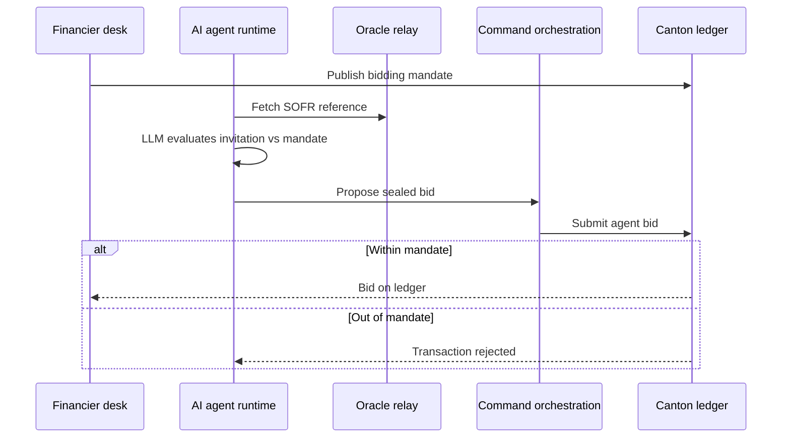

The financier desk configures mandates, enables the agent, and monitors an activity log. Manual bidding remains available alongside agent mode.

### How portals connect to the ledger

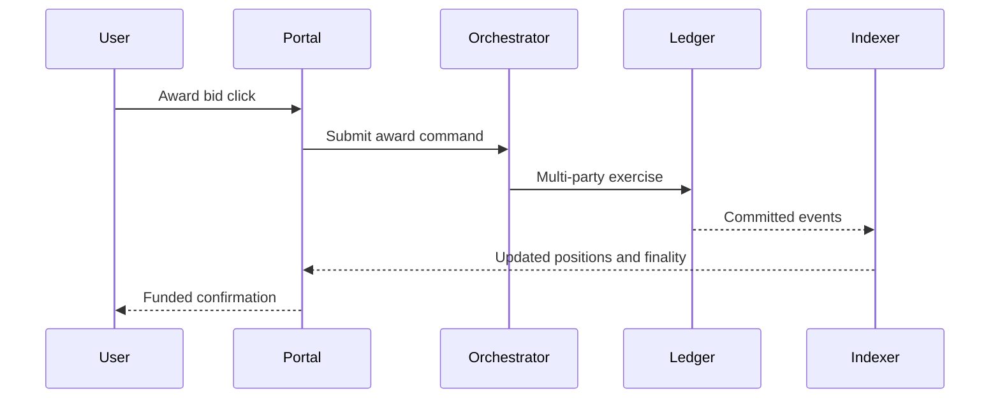

User click → ledger commit → indexer projection → updated UI. Same path for manual and agent-submitted bids.

---

## Roadmap

Building toward **institutional invoice financing and syndication on Canton** — privacy, atomic settlement, and honest finality labels under multi-validator topology.

### Cross-synchronizer settlement

Buyers and registries often sit on **private synchronizers** while suppliers and financiers share a network. Three topologies, each with an explicit label:

| Topology | Guarantee | Behavior |
|----------|-----------|----------|
| **Shared synchronizer** | Single-transaction atomic | Assignment + cash in one commit |
| **Buyer on private sync** | Reassignment-mediated | Core trade atomic; buyer notice crosses domains |
| **Registry on distinct sync** | Escrow-fallback | Bounded escrow with timeout when domains don't meet |

The first diagram shows how award, buyer notice, and cash legs can span synchronizers. The second shows deployment evolution toward per-institution MainNet.

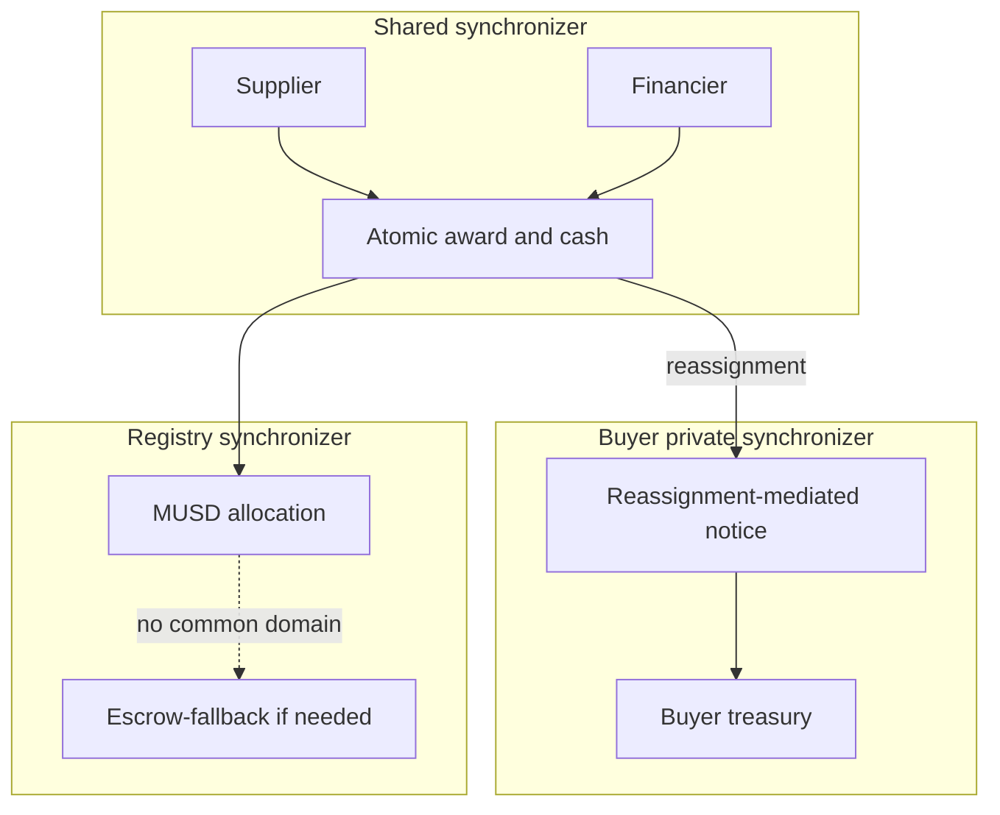

### What we are building next

- Multi-validator deployment and MainNet cutover
- Production KYB/AML integration
- Security review of all ledger authorization paths
- Load and performance validation
- Full visibility-matrix regression as release gate

---

## Conclusion

Meridian is a Canton-native exchange for **private invoice financing and syndication** — sealed bids, oracle-anchored pricing, buyer privacy, pass-through syndication, and atomic settlement with honest finality labels.

| Visible on Canton | Hidden from unauthorized parties |
|-------------------|----------------------------------|
| Payee and face value (buyer view) | Discount rate to buyer |
| Round existence (invitees only) | Competitor bid terms |
| MUSD settlement amounts | Syndication to buyer/supplier |
| Settlement finality class | Participant entry prices |
| Aggregate regulator exposure | Per-trade commercial detail |

**Contributions:** interface-view privacy · sealed primary/secondary markets · atomic CIP-56 DvP · on-ledger mandate enforcement · honest settlement audit — each mapped to Canton primitives and concrete line references in [How Canton Network Enables Meridian](#how-canton-network-enables-meridian).

Invoice financing needs **privacy and interoperability together**. Canton provides institutional parties, sub-transaction privacy, atomic multi-party commit, CIP-56 cash, and cross-domain reassignment — the combination public chains and private databases each fail to deliver alone. See also [Important Files](#important-files-contracts-services-manifests) for the contract and service index.
